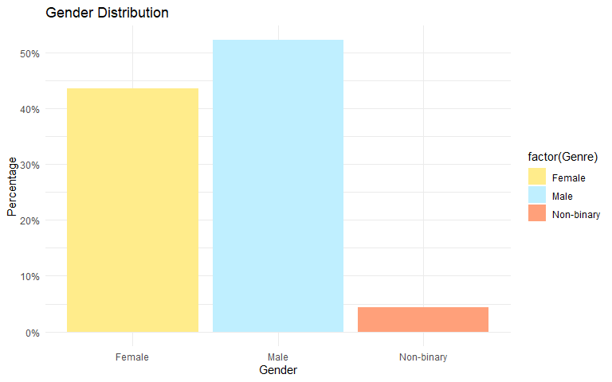
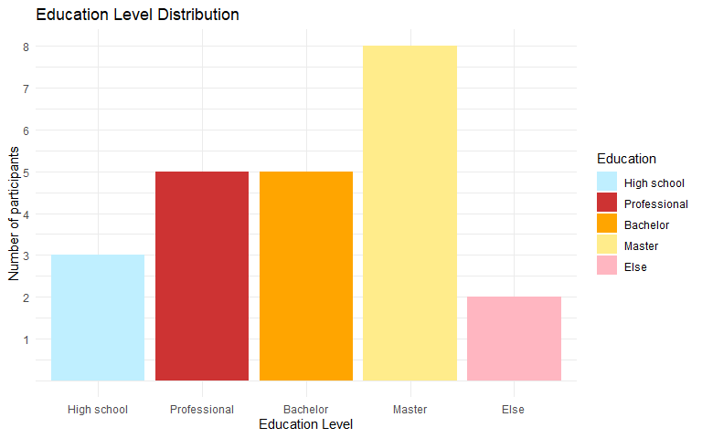
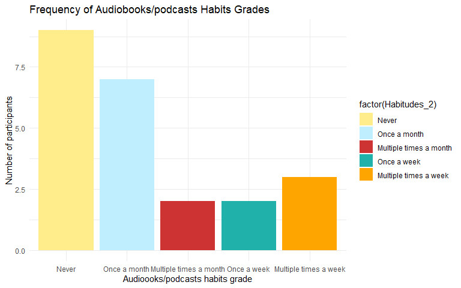
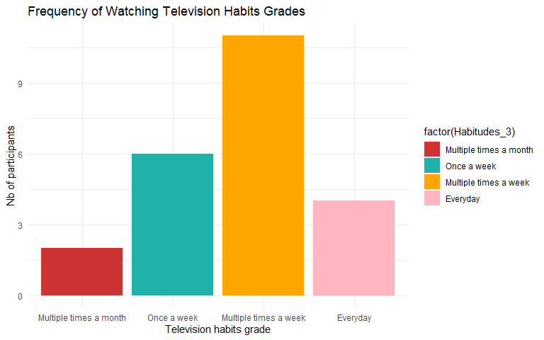
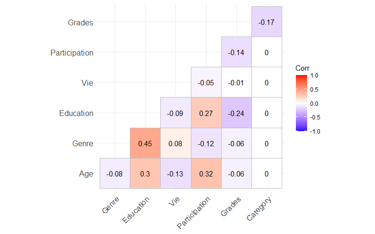
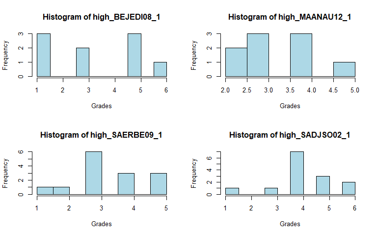

Beyond Stories: Exploring the Influence of Emotional Indicators on the
Subjective Quality Rating of Stories
================
Rachel Ferati
2024-11-18

-   <a href="#results-dataset" id="toc-results-dataset">Results dataset</a>
    -   <a href="#1-data-organization" id="toc-1-data-organization">1. Data
        organization</a>
    -   <a href="#2-mean-and-sd-of-the-dataset"
        id="toc-2-mean-and-sd-of-the-dataset">2. Mean and SD of the dataset</a>
    -   <a href="#3-comparisons" id="toc-3-comparisons">3. Comparisons</a>
    -   <a href="#4-correlation-table" id="toc-4-correlation-table">4.
        Correlation table</a>
    -   <a href="#5-distribution" id="toc-5-distribution">5. Distribution</a>
    -   <a href="#6mann-whitney-u-test"
        id="toc-6mann-whitney-u-test">6.Mann-Whitney U Test</a>
    -   <a href="#7-linear-mixed_effects-model"
        id="toc-7-linear-mixed_effects-model">7. Linear Mixed_effects Model</a>
    -   <a href="#8-common-story" id="toc-8-common-story">8. Common story</a>

# Results dataset

#### Libraries

``` r
library(readr)
library(dplyr)
library(tidyr)
library(ggplot2)
library(kableExtra)
library(knitr)
library(tinytex)
library(ggcorrplot)
library(corrplot)
library(Hmisc)
library(tidyverse)
library(lme4)
library(psych)
library(sjPlot)
```

#### Set options

## 1. Data organization

### Importation and cleaning

#### Import dataset from Qualtrics

``` r
Data_raw <- read_csv("Data_raw.csv")
View(Data_raw)
```

#### Remove 2 first lines of the dataset

``` r
Data_clear_large <- Data_raw[-c(1, 2), ]
View(Data_clear_large)
```

#### Add Category (high or low) to the large table

#### Define prefixes for high and low stories

``` r
high_prefixes <- c("BEJEDI08", "MAANAU12", "SADJSO02", "SAERBE09")
low_prefixes <- c("VEYVEM11", "CLCHJO01", "ANJETI02", "COHEIG03")

Data_clear_large <- Data_clear_large %>%
  rename_with(~ paste0("high_",.), starts_with(high_prefixes)) %>% 
  rename_with(~ paste0("low_",.), starts_with(low_prefixes))

head(Data_clear_large)
```

    ## # A tibble: 6 × 84
    ##   StartDate EndDate Status Progress Duration (in seconds…¹ Finished RecordedDate
    ##   <chr>     <chr>   <chr>  <chr>    <chr>                  <chr>    <chr>       
    ## 1 2024-09-… 2024-0… 0      100      2104                   1        2024-09-17 …
    ## 2 2024-09-… 2024-0… 0      100      1081                   1        2024-09-17 …
    ## 3 2024-09-… 2024-0… 0      100      4061                   1        2024-09-18 …
    ## 4 2024-09-… 2024-0… 0      100      915                    1        2024-09-23 …
    ## 5 2024-09-… 2024-0… 0      100      2786                   1        2024-09-23 …
    ## 6 2024-09-… 2024-0… 0      100      1269                   1        2024-09-24 …
    ## # ℹ abbreviated name: ¹​`Duration (in seconds)`
    ## # ℹ 77 more variables: ResponseId <chr>, DistributionChannel <chr>,
    ## #   UserLanguage <chr>, Q_RecaptchaScore <chr>, Age <chr>, Genre <chr>,
    ## #   Education <chr>, Groupe <chr>, high_BEJEDI08_1 <chr>,
    ## #   high_BEJEDI08_L_1 <chr>, high_BEJEDI08_L_2 <chr>, high_BEJEDI08_L_3 <chr>,
    ## #   high_BEJEDI08_L_4 <chr>, high_BEJEDI08_L_5 <chr>, high_MAANAU12_1 <chr>,
    ## #   high_MAANAU12_L_1 <chr>, high_MAANAU12_L_2 <chr>, …

``` r
View(Data_clear_large)
```

#### Define prefixes and suffixes for high and low stories for exploratory questions

``` r
high_exploratory_prefixes <- c("high_BEJEDI08_L", "high_MAANAU12_L", "high_SADJSO02_L", "high_SAERBE09_L")
low_exploratory_prefixes <- c("low_VEYVEM11_L", "low_CLCHJO01_L", "low_ANJETI02_L", "low_COHEIG03_L")

Data_clear_large <- Data_clear_large %>%
  rename_with(~ paste0("exp_", .), starts_with(high_exploratory_prefixes)) %>% 
  rename_with(~ paste0("exp_", .), starts_with(low_exploratory_prefixes))

head(Data_clear_large)
```

    ## # A tibble: 6 × 84
    ##   StartDate EndDate Status Progress Duration (in seconds…¹ Finished RecordedDate
    ##   <chr>     <chr>   <chr>  <chr>    <chr>                  <chr>    <chr>       
    ## 1 2024-09-… 2024-0… 0      100      2104                   1        2024-09-17 …
    ## 2 2024-09-… 2024-0… 0      100      1081                   1        2024-09-17 …
    ## 3 2024-09-… 2024-0… 0      100      4061                   1        2024-09-18 …
    ## 4 2024-09-… 2024-0… 0      100      915                    1        2024-09-23 …
    ## 5 2024-09-… 2024-0… 0      100      2786                   1        2024-09-23 …
    ## 6 2024-09-… 2024-0… 0      100      1269                   1        2024-09-24 …
    ## # ℹ abbreviated name: ¹​`Duration (in seconds)`
    ## # ℹ 77 more variables: ResponseId <chr>, DistributionChannel <chr>,
    ## #   UserLanguage <chr>, Q_RecaptchaScore <chr>, Age <chr>, Genre <chr>,
    ## #   Education <chr>, Groupe <chr>, high_BEJEDI08_1 <chr>,
    ## #   exp_high_BEJEDI08_L_1 <chr>, exp_high_BEJEDI08_L_2 <chr>,
    ## #   exp_high_BEJEDI08_L_3 <chr>, exp_high_BEJEDI08_L_4 <chr>,
    ## #   exp_high_BEJEDI08_L_5 <chr>, high_MAANAU12_1 <chr>, …

``` r
View(Data_clear_large)
```

``` r
high_exploratory_prefixes <- c("exp_high_BEJEDI08_L", "exp_high_MAANAU12_L", "exp_high_SADJSO02_L", "exp_high_SAERBE09_L")
low_exploratory_prefixes <- c("exp_low_VEYVEM11_L", "exp_low_CLCHJO01_L", "exp_low_ANJETI02_L", "exp_low_COHEIG03_L")

Data_clear_large <- Data_clear_large %>%
  rename_with(~ paste0(.,"_high"), starts_with(high_exploratory_prefixes)) %>% 
  rename_with(~ paste0(.,"_low"), starts_with(low_exploratory_prefixes))

head(Data_clear_large)
```

    ## # A tibble: 6 × 84
    ##   StartDate EndDate Status Progress Duration (in seconds…¹ Finished RecordedDate
    ##   <chr>     <chr>   <chr>  <chr>    <chr>                  <chr>    <chr>       
    ## 1 2024-09-… 2024-0… 0      100      2104                   1        2024-09-17 …
    ## 2 2024-09-… 2024-0… 0      100      1081                   1        2024-09-17 …
    ## 3 2024-09-… 2024-0… 0      100      4061                   1        2024-09-18 …
    ## 4 2024-09-… 2024-0… 0      100      915                    1        2024-09-23 …
    ## 5 2024-09-… 2024-0… 0      100      2786                   1        2024-09-23 …
    ## 6 2024-09-… 2024-0… 0      100      1269                   1        2024-09-24 …
    ## # ℹ abbreviated name: ¹​`Duration (in seconds)`
    ## # ℹ 77 more variables: ResponseId <chr>, DistributionChannel <chr>,
    ## #   UserLanguage <chr>, Q_RecaptchaScore <chr>, Age <chr>, Genre <chr>,
    ## #   Education <chr>, Groupe <chr>, high_BEJEDI08_1 <chr>,
    ## #   exp_high_BEJEDI08_L_1_high <chr>, exp_high_BEJEDI08_L_2_high <chr>,
    ## #   exp_high_BEJEDI08_L_3_high <chr>, exp_high_BEJEDI08_L_4_high <chr>,
    ## #   exp_high_BEJEDI08_L_5_high <chr>, high_MAANAU12_1 <chr>, …

``` r
View(Data_clear_large)
```

------------------------------------------------------------------------

### Long table

#### Convert from wide to long in Data_clear based on high and low stories

``` r
Data_clear_long <- pivot_longer(
  Data_clear_large, 
  cols = starts_with(c("high_", "low_")),
  names_to = "Stories",
  values_to = "Grades"
)
```

#### Move “Stories” and “Grades” to the first two columns

``` r
Data_clear_long <- Data_clear_long %>%
  select(Stories, Grades, everything())

print(Data_clear_long)
```

    ## # A tibble: 192 × 78
    ##    Stories       Grades StartDate EndDate Status Progress Duration (in seconds…¹
    ##    <chr>         <chr>  <chr>     <chr>   <chr>  <chr>    <chr>                 
    ##  1 high_BEJEDI0… <NA>   2024-09-… 2024-0… 0      100      2104                  
    ##  2 high_MAANAU1… <NA>   2024-09-… 2024-0… 0      100      2104                  
    ##  3 high_SAERBE0… 5      2024-09-… 2024-0… 0      100      2104                  
    ##  4 high_SADJSO0… 5      2024-09-… 2024-0… 0      100      2104                  
    ##  5 low_ANJETI02… <NA>   2024-09-… 2024-0… 0      100      2104                  
    ##  6 low_CLCHJO01… <NA>   2024-09-… 2024-0… 0      100      2104                  
    ##  7 low_COHEIG03… 5      2024-09-… 2024-0… 0      100      2104                  
    ##  8 low_VEYVEM11… 5      2024-09-… 2024-0… 0      100      2104                  
    ##  9 high_BEJEDI0… <NA>   2024-09-… 2024-0… 0      100      1081                  
    ## 10 high_MAANAU1… <NA>   2024-09-… 2024-0… 0      100      1081                  
    ## # ℹ 182 more rows
    ## # ℹ abbreviated name: ¹​`Duration (in seconds)`
    ## # ℹ 71 more variables: Finished <chr>, RecordedDate <chr>, ResponseId <chr>,
    ## #   DistributionChannel <chr>, UserLanguage <chr>, Q_RecaptchaScore <chr>,
    ## #   Age <chr>, Genre <chr>, Education <chr>, Groupe <chr>,
    ## #   exp_high_BEJEDI08_L_1_high <chr>, exp_high_BEJEDI08_L_2_high <chr>,
    ## #   exp_high_BEJEDI08_L_3_high <chr>, exp_high_BEJEDI08_L_4_high <chr>, …

``` r
View(Data_clear_long)
```

#### Add the column “Category” to the dataset

``` r
Data_clear_long <- Data_clear_long %>%
  mutate(
    Category = case_when(
      grepl("^(high_BEJEDI08|high_MAANAU12|high_SADJSO02|high_SAERBE09)", Stories) ~ "high",
      grepl("^(low_VEYVEM11|low_CLCHJO01|low_ANJETI02|low_COHEIG03)", Stories) ~ "low",
    )
  )%>%
  select(1:2, Category, everything())  # Moves Category to the 3rd position

Data_clear_long$Category<- as.factor(Data_clear_long$Category)

View(Data_clear_long)
```

------------------------------------------------------------------------

### Exclusion of participants

``` r
Data_clear_large <- Data_clear_large %>%
  filter(Attention == 3)
```

``` r
Data_clear_long <- Data_clear_long %>%
  filter(Attention == 3)
```

## 2. Mean and SD of the dataset

#### Convert columns in Data_clear_large to numeric

``` r
Data_clear_large[, 12:84] <- lapply(Data_clear_large[, 12:84], function(x) as.numeric(as.character(x)))
```

------------------------------------------------------------------------

### AGE

``` r
summary(Data_clear_large$Age)
```

    ##    Min. 1st Qu.  Median    Mean 3rd Qu.    Max. 
    ##   23.00   24.00   31.00   34.20   39.75   63.00

``` r
sum(is.na(Data_clear_large$Age))
```

    ## [1] 0

#### Calculate Mean and SD for AGE

``` r
mean_age <- mean(Data_clear_large$Age, na.rm = TRUE)
sd_age <- sd(Data_clear_large$Age, na.rm = TRUE)

cat("Mean Age:", mean_age, "\n")
```

    ## Mean Age: 34.2

``` r
cat("Standard Deviation of Age:", sd_age, "\n")
```

    ## Standard Deviation of Age: 12.60576

#### Frequency distribution of Age

``` r
age_distribution <- table(Data_clear_large$Age)
print(age_distribution)
```

    ## 
    ## 23 24 27 31 33 39 42 45 56 59 63 
    ##  4  2  3  3  2  1  1  1  1  1  1

#### Percentage of Age

``` r
frequency_table_age <- table(Data_clear_large$Age)

percentage_table_age <- prop.table(frequency_table_age) * 100

percentage_age_df <- as.data.frame(percentage_table_age)
colnames(percentage_age_df) <- c("Age", "Percentage")

print(percentage_age_df)
```

    ##    Age Percentage
    ## 1   23         20
    ## 2   24         10
    ## 3   27         15
    ## 4   31         15
    ## 5   33         10
    ## 6   39          5
    ## 7   42          5
    ## 8   45          5
    ## 9   56          5
    ## 10  59          5
    ## 11  63          5

#### Visual of Age distribution in the dataset

``` r
ggplot(Data_clear_large, aes(x = Age)) +
  geom_histogram(fill = "skyblue", color = "black") +
  labs(title = "Age Distribution", x = "Age", y = "Number of participants") +
  theme_minimal()
```


``` r
ggplot(Data_clear_large, aes(x = Age)) +
  geom_density(fill = "skyblue", alpha = 0.5) +
  labs(title = "Age Density Distribution", x = "Age", y = "Density") +
  theme_minimal()
```


------------------------------------------------------------------------

### GENDER

``` r
summary(Data_clear_large$Genre)
```

    ##    Min. 1st Qu.  Median    Mean 3rd Qu.    Max. 
    ##    1.00    1.00    2.00    1.65    2.00    3.00

``` r
sum(is.na(Data_clear_large$Genre))
```

    ## [1] 0

#### Calculate Mean and SD of Genre

``` r
mean_genre <- mean(Data_clear_large$Genre, na.rm = TRUE)
sd_genre <- sd(Data_clear_large$Genre, na.rm = TRUE)

cat("Mean Genre:", mean_genre, "\n")
```

    ## Mean Genre: 1.65

``` r
cat("Standard Deviation of Genre:", sd_genre, "\n")
```

    ## Standard Deviation of Genre: 0.5871429

#### Frequency distribution of Genre

``` r
genre_distribution <- table(Data_clear_large$Genre)

print(genre_distribution)
```

    ## 
    ##  1  2  3 
    ##  8 11  1

#### Percentage of Gender

``` r
frequency_table_gender <- table(Data_clear_large$Genre)

percentage_table_gender <- prop.table(frequency_table_gender) * 100

percentage_gender_df <- as.data.frame(percentage_table_gender)
colnames(percentage_gender_df) <- c("Gender", "Percentage")

print(percentage_gender_df)
```

    ##   Gender Percentage
    ## 1      1         40
    ## 2      2         55
    ## 3      3          5

#### Visual of Gender distribution in the dataset

``` r
ggplot(Data_clear_large, aes(x = factor(Genre), y = (..count..)/sum(..count..), fill = factor(Genre))) +
  geom_bar() +
  scale_y_continuous(labels = scales::percent_format()) +
  scale_fill_manual(values = c("1" = "lightgoldenrod1", "2" = "lightblue1", "3" = "lightsalmon"),
                    labels = c("Female", "Male", "Non-binary")) + 
  labs(title = "Gender Distribution", x = "Gender", y = "Percentage") +
  scale_x_discrete(labels = c("1" = "Female", "2" = "Male", "3" = "Non-binary")) +
  theme_minimal()
```



------------------------------------------------------------------------

### EDUCATION

``` r
summary(Data_clear_large$Education)
```

    ##    Min. 1st Qu.  Median    Mean 3rd Qu.    Max. 
    ##    2.00    3.00    6.00    5.45    7.00    8.00

#### Calculate Mean and SD of Education

``` r
mean_education <- mean(Data_clear_large$Education, na.rm = TRUE)
sd_education <- sd(Data_clear_large$Education, na.rm = TRUE)

cat("Mean Education:", mean_education, "\n")
```

    ## Mean Education: 5.45

``` r
cat("Standard Deviation of Education:", sd_education, "\n")
```

    ## Standard Deviation of Education: 1.986136

#### Frequency distribution of Education

``` r
education_distribution <- table(Data_clear_large$Education)

print(education_distribution)
```

    ## 
    ## 2 3 5 7 8 
    ## 1 5 4 8 2

#### Percentage of Education

``` r
frequency_table_education <- table(Data_clear_large$Education)

percentage_table_education <- prop.table(frequency_table_education) * 100

percentage_education_df <- as.data.frame(percentage_table_education)
colnames(percentage_education_df) <- c("Level of Education", "Percentage")

print(percentage_education_df)
```

    ##   Level of Education Percentage
    ## 1                  2          5
    ## 2                  3         25
    ## 3                  5         20
    ## 4                  7         40
    ## 5                  8         10

#### Visual of Education distribution in the dataset

``` r
ggplot(Data_clear_large, aes(x = factor(Education), fill = factor(Education))) +
  geom_bar() +
  scale_y_continuous(breaks = seq(1, 8, by = 1), limits = c(0, 8)) +
  scale_fill_manual(values = c("1" = "lightgoldenrod1", "2" = "lightblue1", "3" = "brown3", "4" = "red", "5" = "orange", "6" = "blue", "7" = "lightgoldenrod1", "8" = "lightpink"),
                    labels = c("High school", "Professional","Bachelor", "Master", "Else")) +
  scale_x_discrete(labels = c("1" = "Secondary", "2" = "High school", "3" = "Professional", "4" = "Federal", "5" = "Bachelor", "7" = "Master", "8" = "Else")) +
  labs(title = "Education Level Distribution", x = "Education Level", y = "Number of participants", fill = "Education") +
  theme_minimal()
```



------------------------------------------------------------------------

### SIMILAR LIVING EXPERIENCE (Vie)

``` r
summary(Data_clear_large$Vie)
```

    ##    Min. 1st Qu.  Median    Mean 3rd Qu.    Max. 
    ##    1.00    1.00    1.00    1.35    2.00    2.00

#### Calculate Mean and SD of Vie

``` r
mean_vie <- mean(Data_clear_large$Vie, na.rm = TRUE)
sd_vie <- sd(Data_clear_large$Vie, na.rm = TRUE)

cat("Mean Vie:", mean_vie, "\n")
```

    ## Mean Vie: 1.35

``` r
cat("Standard Deviation of Vie:", sd_vie, "\n")
```

    ## Standard Deviation of Vie: 0.4893605

#### Frequency distribution of Vie

``` r
vie_distribution <- table(Data_clear_large$Vie)

print(vie_distribution)
```

    ## 
    ##  1  2 
    ## 13  7

#### Percentage of Similar living experience

``` r
frequency_table_vie <- table(Data_clear_large$Vie)

percentage_table_vie <- prop.table(frequency_table_vie) * 100

percentage_vie_df <- as.data.frame(percentage_table_vie)
colnames(percentage_vie_df) <- c("Similar living experience", "Percentage")

print(percentage_vie_df)
```

    ##   Similar living experience Percentage
    ## 1                         1         65
    ## 2                         2         35

#### Visual of Vie distribution in the dataset

``` r
ggplot(Data_clear_large, aes(x = factor(Vie), fill = factor(Vie))) +
  geom_bar() +
  scale_fill_manual(values = c("1" = "lightcoral", "2" = "lightblue1"),
                    labels = c("Yes", "No")) +
  labs(title = "Similar Life Experience Distribution", x = "Vie", y = "Number of participants") +
  scale_x_discrete(labels = c("1" = "Yes", "2" = "No")) +
  theme_minimal()
```


------------------------------------------------------------------------

### PARTICIPATION

``` r
summary(Data_clear_large$Participation)
```

    ##    Min. 1st Qu.  Median    Mean 3rd Qu.    Max. 
    ##    1.00    1.00    2.00    1.65    2.00    2.00

#### Calculate Mean and SD of Participation

``` r
mean_participation <- mean(Data_clear_large$Participation, na.rm = TRUE)
sd_participation <- sd(Data_clear_large$Participation, na.rm = TRUE)

cat("Mean Participation:", mean_participation, "\n")
```

    ## Mean Participation: 1.65

``` r
cat("Standard Deviation of Participation:", sd_participation, "\n")
```

    ## Standard Deviation of Participation: 0.4893605

#### Frequency distribution of Participation

``` r
participation_distribution <- table(Data_clear_large$Participation)

print(participation_distribution)
```

    ## 
    ##  1  2 
    ##  7 13

#### Percentage of participation in the previous experiment

``` r
frequency_table_participation <- table(Data_clear_large$Participation)

percentage_table_participation <- prop.table(frequency_table_participation) * 100

percentage_participation_df <- as.data.frame(percentage_table_participation)
colnames(percentage_participation_df) <- c("Participation in previous experiment", "Percentage")

print(percentage_participation_df)
```

    ##   Participation in previous experiment Percentage
    ## 1                                    1         35
    ## 2                                    2         65

#### Visual of Participation distribution in the dataset

``` r
ggplot(Data_clear_large, aes(x = factor(Participation), fill = factor(Participation))) +
  geom_bar() +
  scale_fill_manual(values = c("1" = "lightcoral", "2" = "lightblue1"),
                    labels = c("Yes", "No")) +
  labs(title = "Previous Participation Distribution", x = "Participation", y = "Number of participants") +
  scale_x_discrete(labels = c("1" = "Yes", "2" = "No")) +
  theme_minimal()
```


------------------------------------------------------------------------

### HABITS

#### Habits - BOOKS

``` r
summary(Data_clear_large$Habitudes_1)
```

    ##    Min. 1st Qu.  Median    Mean 3rd Qu.    Max. 
    ##    1.00    2.00    3.00    3.70    5.25    6.00

#### Calculate mean and SD of Habits for books

``` r
mean_habits_books <- mean(Data_clear_large$Habitudes_1, na.rm = TRUE)
sd_habits_books <- sd(Data_clear_large$Habitudes_1, na.rm = TRUE)

cat("Mean Books habits:", mean_habits_books, "\n")
```

    ## Mean Books habits: 3.7

``` r
cat("Standard Deviation of Books habits:", sd_habits_books, "\n")
```

    ## Standard Deviation of Books habits: 1.750188

#### Frequency distribution habits of books

``` r
habits_books_distribution <- table(Data_clear_large$Habitudes_1)

print(habits_books_distribution)
```

    ## 
    ## 1 2 3 4 5 6 
    ## 1 6 4 1 3 5

#### Percentage of books habits

``` r
frequency_table_books <- table(Data_clear_large$Habitudes_1)

percentage_table_books <- prop.table(frequency_table_books) * 100

percentage_books_df <- as.data.frame(percentage_table_books)
colnames(percentage_books_df) <- c("Grade", "Percentage")

print(percentage_books_df)
```

    ##   Grade Percentage
    ## 1     1          5
    ## 2     2         30
    ## 3     3         20
    ## 4     4          5
    ## 5     5         15
    ## 6     6         25

#### Visual of Books habits distribution in the dataset

``` r
ggplot(Data_clear_large, aes(x = factor(Habitudes_1), fill = factor(Habitudes_1))) +
  geom_bar() +
  scale_fill_manual(values = c("1" = "lightgoldenrod1", "2" = "lightblue1", "3" = "brown3", "4" = "lightseagreen", "5" = "orange", "6" = "lightpink"),
                    labels = c("Never", "Once a month", "Multiple times a month", "Once a week", "Multiple times a week", "Everyday")) +
  scale_x_discrete(labels = c("1" = "Never", "2" = "Once a month", "3" = "Multiple times a month", "4" = "Once a week", "5" = "Multiple times a week", "6" = "Everyday")) +
  labs(title = "Frequency of Reading Habits Grades", x = "Book habits grade", y = "Number of participants") +
  theme_minimal()
```


------------------------------------------------------------------------

#### Habits - AUDIOBOOKS

``` r
summary(Data_clear_large$Habitudes_2)
```

    ##    Min. 1st Qu.  Median    Mean 3rd Qu.    Max. 
    ##    1.00    1.00    2.00    2.15    2.25    5.00

#### Calculate mean and SD of Habits for audiobooks/podcasts

``` r
mean_habits_audiobooks <- mean(Data_clear_large$Habitudes_2, na.rm = TRUE)
sd_habits_audiobooks <- sd(Data_clear_large$Habitudes_2, na.rm = TRUE)

cat("Mean Audiobooks habits:", mean_habits_audiobooks, "\n")
```

    ## Mean Audiobooks habits: 2.15

``` r
cat("Standard Deviation of Audiobooks habits:", sd_habits_audiobooks, "\n")
```

    ## Standard Deviation of Audiobooks habits: 1.348488

#### Frequency distribution habits of audiobooks

``` r
habits_audiobooks_distribution <- table(Data_clear_large$Habitudes_2)

print(habits_audiobooks_distribution)
```

    ## 
    ## 1 2 3 4 5 
    ## 8 7 1 2 2

#### Percentage of audiobooks habits

``` r
frequency_table_audiobooks <- table(Data_clear_large$Habitudes_2)

percentage_table_audiobooks <- prop.table(frequency_table_audiobooks) * 100

percentage_audiobooks_df <- as.data.frame(percentage_table_audiobooks)
colnames(percentage_audiobooks_df) <- c("Grade", "Percentage")

print(percentage_audiobooks_df)
```

    ##   Grade Percentage
    ## 1     1         40
    ## 2     2         35
    ## 3     3          5
    ## 4     4         10
    ## 5     5         10

#### Visual of audiobooks habits distribution in the dataset

``` r
ggplot(Data_clear_large, aes(x = factor(Habitudes_2), fill = factor(Habitudes_2))) +
  geom_bar() +
    scale_fill_manual(values = c("1" = "lightgoldenrod1", "2" = "lightblue1", "3" = "brown3", "4" = "lightseagreen", "5" = "orange", "6" = "lightpink"),
                    labels = c("Never", "Once a month", "Multiple times a month", "Once a week", "Multiple times a week", "Everyday")) +
  scale_x_discrete(labels = c("1" = "Never", "2" = "Once a month", "3" = "Multiple times a month", "4" = "Once a week", "5" = "Multiple times a week", "6" = "Everyday")) +
  labs(title = "Frequency of Audiobooks/podcasts Habits Grades", x = "Audioooks/podcasts habits grade", y = "Number of participants") +
  theme_minimal()
```



------------------------------------------------------------------------

#### Habits - TELEVISION

``` r
summary(Data_clear_large$Habitudes_3)
```

    ##    Min. 1st Qu.  Median    Mean 3rd Qu.    Max. 
    ##     3.0     4.0     5.0     4.8     5.0     6.0

#### Calculate mean and SD of Habits for television

``` r
mean_habits_television <- mean(Data_clear_large$Habitudes_3, na.rm = TRUE)
sd_habits_television <- sd(Data_clear_large$Habitudes_3, na.rm = TRUE)

cat("Mean television habits:", mean_habits_television, "\n")
```

    ## Mean television habits: 4.8

``` r
cat("Standard Deviation of television habits:", sd_habits_television, "\n")
```

    ## Standard Deviation of television habits: 0.8335088

#### Frequency distribution habits of television

``` r
habits_television_distribution <- table(Data_clear_large$Habitudes_3)

print(habits_television_distribution)
```

    ## 
    ## 3 4 5 6 
    ## 1 6 9 4

#### Percentage of television habits

``` r
frequency_table_television <- table(Data_clear_large$Habitudes_3)

percentage_table_television <- prop.table(frequency_table_television) * 100

percentage_television_df <- as.data.frame(percentage_table_television)
colnames(percentage_television_df) <- c("Grade", "Percentage")

print(percentage_television_df)
```

    ##   Grade Percentage
    ## 1     3          5
    ## 2     4         30
    ## 3     5         45
    ## 4     6         20

#### Visual of television habits distribution in the dataset

``` r
ggplot(Data_clear_large, aes(x = factor(Habitudes_3), fill = factor(Habitudes_3))) +
  geom_bar() +
  scale_fill_manual(values = c("3" = "brown3", "4" = "lightseagreen", "5" = "orange", "6" = "lightpink"),
                    labels = c("Multiple times a month", "Once a week", "Multiple times a week", "Everyday")) +
  scale_x_discrete(labels = c("1" = "Never", "2" = "Once a month", "3" = "Multiple times a month", "4" = "Once a week", "5" = "Multiple times a week", "6" = "Everyday")) +
  labs(title = "Frequency of Watching Television Habits Grades", x = "Television habits grade", y = "Nb of participants") +
  theme_minimal()
```



------------------------------------------------------------------------

#### Habits - SOCIALMEDIA

``` r
summary(Data_clear_large$Habitudes_4)
```

    ##    Min. 1st Qu.  Median    Mean 3rd Qu.    Max. 
    ##       2       5       5       5       6       6

#### Calculate mean and SD of Habits for social media

``` r
mean_habits_socialmedia <- mean(Data_clear_large$Habitudes_4, na.rm = TRUE)
sd_habits_socialmedia <- sd(Data_clear_large$Habitudes_4, na.rm = TRUE)

cat("Mean socialmedia habits:", mean_habits_socialmedia, "\n")
```

    ## Mean socialmedia habits: 5

``` r
cat("Standard Deviation of socialmedia habits:", sd_habits_socialmedia, "\n")
```

    ## Standard Deviation of socialmedia habits: 1.256562

#### Frequency distribution habits of television

``` r
habits_socialmedia_distribution <- table(Data_clear_large$Habitudes_4)

print(habits_socialmedia_distribution)
```

    ## 
    ## 2 3 5 6 
    ## 1 3 7 9

#### Percentage of television habits

``` r
frequency_table_socialmedia <- table(Data_clear_large$Habitudes_4)

percentage_table_socialmedia <- prop.table(frequency_table_socialmedia) * 100

percentage_socialmedia_df <- as.data.frame(percentage_table_socialmedia)
colnames(percentage_socialmedia_df) <- c("Grade", "Percentage")

print(percentage_socialmedia_df)
```

    ##   Grade Percentage
    ## 1     2          5
    ## 2     3         15
    ## 3     5         35
    ## 4     6         45

#### Visual of socialmedia habits distribution in the dataset

``` r
ggplot(Data_clear_large, aes(x = factor(Habitudes_4), fill = factor(Habitudes_4))) +
  geom_bar() +
  scale_fill_manual(values = c("2" = "lightblue1", "3" = "brown3", "5" = "orange", "6" = "lightpink"),
                    labels = c("Once a month", "Multiple times a month", "Multiple times a week", "Everyday")) +
  scale_x_discrete(labels = c("1" = "Never", "2" = "Once a month", "3" = "Multiple times a month", "4" = "Once a week", "5" = "Multiple times a week", "6" = "Everyday")) +
  labs(title = "Frequency of Social media Habit Grades", x = "Social media habits grade", y = "Nb of participants") +
  theme_minimal()
```


------------------------------------------------------------------------

#### Habits - VIDEO GAMES

``` r
summary(Data_clear_large$Habitudes_5)
```

    ##    Min. 1st Qu.  Median    Mean 3rd Qu.    Max. 
    ##     1.0     1.0     1.0     2.1     3.0     6.0

#### Calculate mean and SD of Habits for video games

``` r
mean_habits_videogames <- mean(Data_clear_large$Habitudes_5, na.rm = TRUE)
sd_habits_videogames <- sd(Data_clear_large$Habitudes_5, na.rm = TRUE)

cat("Mean videogames habits:", mean_habits_videogames, "\n")
```

    ## Mean videogames habits: 2.1

``` r
cat("Standard Deviation of videogames habits:", sd_habits_videogames, "\n")
```

    ## Standard Deviation of videogames habits: 1.586124

#### Frequency distribution habits of video games

``` r
habits_videogames_distribution <- table(Data_clear_large$Habitudes_5)

print(habits_videogames_distribution)
```

    ## 
    ##  1  2  3  5  6 
    ## 11  3  3  2  1

#### Percentage of television habits

``` r
frequency_table_videogames <- table(Data_clear_large$Habitudes_5)

percentage_table_videogames <- prop.table(frequency_table_videogames) * 100

percentage_videogames_df <- as.data.frame(percentage_table_videogames)
colnames(percentage_videogames_df) <- c("Grade", "Percentage")

print(percentage_videogames_df)
```

    ##   Grade Percentage
    ## 1     1         55
    ## 2     2         15
    ## 3     3         15
    ## 4     5         10
    ## 5     6          5

#### Visual of videogames habits distribution in the dataset

``` r
ggplot(Data_clear_large, aes(x = factor(Habitudes_5), fill = factor(Habitudes_5))) +
  geom_bar() +
  scale_fill_manual(values = c("1" = "lightgoldenrod1", "2" = "lightblue1", "3" = "brown3", "5" = "orange", "6" = "lightpink"),
                    labels = c("Never", "Once a month", "Multiple times a month", "Multiple times a week", "Everyday")) +
  scale_x_discrete(labels = c("1" = "Never", "2" = "Once a month", "3" = "Multiple times a month", "4" = "Once a week", "5" = "Multiple times a week", "6" = "Everyday")) +
  labs(title = "Frequency of Video games Habit Grades", x = "Video games habits grade", y = "Nb of participants") +
  theme_minimal()
```


------------------------------------------------------------------------

#### Habits - ORAL STORIES

``` r
summary(Data_clear_large$Habitudes_6)
```

    ##    Min. 1st Qu.  Median    Mean 3rd Qu.    Max. 
    ##       1       2       5       4       6       6

#### Calculate mean and SD of Habits for Oral stories

``` r
mean_habits_oralstories <- mean(Data_clear_large$Habitudes_6, na.rm = TRUE)
sd_habits_oralstories  <- sd(Data_clear_large$Habitudes_6, na.rm = TRUE)

cat("Mean oralstories habits:", mean_habits_oralstories , "\n")
```

    ## Mean oralstories habits: 4

``` r
cat("Standard Deviation of oralstories habits:", sd_habits_oralstories , "\n")
```

    ## Standard Deviation of oralstories habits: 1.91943

#### Frequency distribution habits of oral stories

``` r
habits_oralstories_distribution <- table(Data_clear_large$Habitudes_6)

print(habits_oralstories_distribution)
```

    ## 
    ## 1 2 3 4 5 6 
    ## 3 3 2 1 5 6

#### Percentage of oral stories habits

``` r
frequency_table_oralstories <- table(Data_clear_large$Habitudes_6)

percentage_table_oralstories <- prop.table(frequency_table_oralstories) * 100

percentage_oralstories_df <- as.data.frame(percentage_table_oralstories)
colnames(percentage_oralstories_df) <- c("Grade", "Percentage")

print(percentage_oralstories_df)
```

    ##   Grade Percentage
    ## 1     1         15
    ## 2     2         15
    ## 3     3         10
    ## 4     4          5
    ## 5     5         25
    ## 6     6         30

#### Visual of oralstories habits distribution in the dataset

``` r
ggplot(Data_clear_large, aes(x = factor(Habitudes_6), fill = factor(Habitudes_6))) +
  geom_bar() +
  scale_fill_manual(values = c("1" = "lightgoldenrod1", "2" = "lightblue1", "3" = "brown3", "4" = "lightseagreen", "5" = "orange", "6" = "lightpink"),
                    labels = c("Never", "Once a month", "Multiple times a month", "Once a week", "Multiple times a week", "Everyday")) +
  scale_x_discrete(labels = c("1" = "Never", "2" = "Once a month", "3" = "Multiple times a month", "4" = "Once a week", "5" = "Multiple times a week", "6" = "Everyday")) +
  labs(title = "Frequency of Oral stories Habit Grades", x = "Oral stories habits grade", y = "Nb of participants") +
  theme_minimal()
```


------------------------------------------------------------------------

### STORIES WITH HIGH GRANULARITY

#### Select columns that start with “high\_” and convert to numeric

``` r
stories_high <- Data_clear_large %>%
  select(starts_with("high_")) %>%
  mutate(across(everything(), ~ as.numeric(as.character(.))))
```

#### Check for any NA values introduced by coercion

``` r
na_count <- sum(is.na(stories_high))
if (na_count > 0) {
  cat("Warning: NA values were introduced during conversion. Count:", na_count, "\n")
}
```

    ## Warning: NA values were introduced during conversion. Count: 40

#### Calculate mean and SD for each column starting with “high\_” (for high Stories)

``` r
mean_values <- colMeans(stories_high, na.rm = TRUE)
sd_values <- apply(stories_high, 2, sd, na.rm = TRUE)
```

#### Combine the results into a data frame for better readability

``` r
results_high_stories <- data.frame(
  Column = names(mean_values),
  Mean = mean_values,
  SD = sd_values
)

print(results_high_stories)
```

    ##                          Column     Mean        SD
    ## high_BEJEDI08_1 high_BEJEDI08_1 3.000000 2.0000000
    ## high_MAANAU12_1 high_MAANAU12_1 3.000000 0.8164966
    ## high_SAERBE09_1 high_SAERBE09_1 3.384615 1.1929279
    ## high_SADJSO02_1 high_SADJSO02_1 4.230769 1.3008873

``` r
View(results_high_stories)
```

------------------------------------------------------------------------

### STORIES WITH HIGH GRANULARITY OVERALL

#### Calculate overall mean and standard deviation for high stories across all participants

``` r
Data_clear_large[, grep("^high_", names(Data_clear_large))] <- 
  lapply(Data_clear_large[, grep("^high_", names(Data_clear_large))], 
         function(x) as.numeric(as.character(x)))


Overall_Mean_Grade <- mean(unlist(Data_clear_large[, grep("^high_", names(Data_clear_large))]), na.rm = TRUE)
Overall_SD_Grade <- sd(unlist(Data_clear_large[, grep("^high_", names(Data_clear_large))]), na.rm = TRUE)


overall_results_high_stories <- list(
  Overall_Mean_Grade = Overall_Mean_Grade,
  Overall_SD_Grade = Overall_SD_Grade
)

print(overall_results_high_stories)
```

    ## $Overall_Mean_Grade
    ## [1] 3.525
    ## 
    ## $Overall_SD_Grade
    ## [1] 1.395735

------------------------------------------------------------------------

### STORIES WITH LOW GRANULARITY

#### Select columns that starts with “low\_” and convert to numeric

``` r
stories_low <- Data_clear_large %>%
  select(starts_with("low_")) %>%
  mutate(across(everything(), ~ as.numeric(as.character(.))))
```

#### Check for any NA values introduced by coercion

``` r
na_count <- sum(is.na(stories_low))
if (na_count > 0) {
  cat("Warning: NA values were introduced during conversion. Count:", na_count, "\n")
}
```

    ## Warning: NA values were introduced during conversion. Count: 40

#### Calculate mean and SD for each column starting with “low\_” (for low Stories)

``` r
mean_values <- colMeans(stories_low, na.rm = TRUE)
sd_values <- apply(stories_low, 2, sd, na.rm = TRUE)
```

#### Combine the results into a data frame for better readability

``` r
results_low_stories <- data.frame(
  Column = names(mean_values),
  Mean = mean_values,
  SD = sd_values
)

print(results_low_stories)
```

    ##                        Column     Mean       SD
    ## low_ANJETI02_1 low_ANJETI02_1 2.571429 1.272418
    ## low_CLCHJO01_1 low_CLCHJO01_1 2.428571 1.397276
    ## low_COHEIG03_1 low_COHEIG03_1 3.307692 1.109400
    ## low_VEYVEM11_1 low_VEYVEM11_1 3.769231 1.235168

``` r
View(results_low_stories)
```

------------------------------------------------------------------------

### STORIES WITH LOW GRANULARITY OVERALL

#### Calculate overall mean and standard deviation for low stories across all participants

``` r
Data_clear_large[, grep("^low_", names(Data_clear_large))] <- 
  lapply(Data_clear_large[, grep("^low_", names(Data_clear_large))], 
         function(x) as.numeric(as.character(x)))

Overall_Mean_Grade_low <- mean(unlist(Data_clear_large[, grep("^low_", names(Data_clear_large))]), na.rm = TRUE)
Overall_SD_Grade_low <- sd(unlist(Data_clear_large[, grep("^low_", names(Data_clear_large))]), na.rm = TRUE)

overall_results_low_stories <- list(
  Overall_Mean_Grade = Overall_Mean_Grade_low,
  Overall_SD_Grade = Overall_SD_Grade_low
)

print(overall_results_low_stories)
```

    ## $Overall_Mean_Grade
    ## [1] 3.175
    ## 
    ## $Overall_SD_Grade
    ## [1] 1.298668

------------------------------------------------------------------------

### STORIES HIGH GRANULARITY - Entertainment (\_L_1\_high)

#### Select columns that end with “\_L_1\_high” and convert to numeric

``` r
stories_Entertainment_high <- Data_clear_large %>%
  select(ends_with("_L_1_high")) %>%
  mutate(across(everything(), ~ as.numeric(as.character(.))))
```

#### Check for any NA values introduced by coercion

``` r
na_count <- sum(is.na(stories_Entertainment_high))
if (na_count > 0) {
  cat("Warning: NA values were introduced during conversion. Count:", na_count, "\n")
}
```

    ## Warning: NA values were introduced during conversion. Count: 40

#### Calculate mean and SD for each column ending with “\_L_1\_high”

``` r
mean_values <- colMeans(stories_Entertainment_high, na.rm = TRUE)
sd_values <- apply(stories_Entertainment_high, 2, sd, na.rm = TRUE)
```

#### Combine the results into a data frame for better readability

``` r
results_stories_Entertainment_high <- data.frame(
  Column = names(mean_values),
  Mean = mean_values,
  SD = sd_values
)

print(results_stories_Entertainment_high)
```

    ##                                                Column     Mean       SD
    ## exp_high_BEJEDI08_L_1_high exp_high_BEJEDI08_L_1_high 2.714286 1.380131
    ## exp_high_MAANAU12_L_1_high exp_high_MAANAU12_L_1_high 2.285714 0.487950
    ## exp_high_SAERBE09_L_1_high exp_high_SAERBE09_L_1_high 2.923077 1.037749
    ## exp_high_SADJSO02_L_1_high exp_high_SADJSO02_L_1_high 3.461538 1.126601

``` r
View(results_stories_Entertainment_high)
```

------------------------------------------------------------------------

### STORIES HIGH GRANULARITY - Entertainment (\_L_1\_high) OVERALL

#### Calculate overall mean and standard deviation for Entertainment in high stories across all participants

``` r
Data_clear_large[, grep("_L_1_high$", names(Data_clear_large))] <- 
  lapply(Data_clear_large[, grep("_L_1_high$", names(Data_clear_large))], 
         function(x) as.numeric(as.character(x)))

Overall_Mean_Grade_Entertainment_high <- mean(unlist(Data_clear_large[, grep("_L_1_high$", names(Data_clear_large))]), na.rm = TRUE)
Overall_SD_Grade_Entertainment_high <- sd(unlist(Data_clear_large[, grep("_L_1_high$", names(Data_clear_large))]), na.rm = TRUE)

overall_results_Entertainment_high <- list(
  Overall_Mean_Grade = Overall_Mean_Grade_Entertainment_high,
  Overall_SD_Grade = Overall_SD_Grade_Entertainment_high
)

print(overall_results_Entertainment_high)
```

    ## $Overall_Mean_Grade
    ## [1] 2.95
    ## 
    ## $Overall_SD_Grade
    ## [1] 1.108244

------------------------------------------------------------------------

### STORIES HIGH GRANULARITY - Emotionality (\_L_2\_high)

#### Select columns that end with “\_L_2\_high” and convert to numeric

``` r
stories_Emotionality_high <- Data_clear_large %>%
  select(ends_with("_L_2_high")) %>%
  mutate(across(everything(), ~ as.numeric(as.character(.))))
```

#### Check for any NA values introduced by coercion

``` r
na_count <- sum(is.na(stories_Emotionality_high))
if (na_count > 0) {
  cat("Warning: NA values were introduced during conversion. Count:", na_count, "\n")
}
```

    ## Warning: NA values were introduced during conversion. Count: 40

#### Calculate mean and SD for each column ending with “\_L_2\_high”

``` r
mean_values <- colMeans(stories_Emotionality_high, na.rm = TRUE)
sd_values <- apply(stories_Emotionality_high, 2, sd, na.rm = TRUE)
```

#### Combine the results into a data frame for better readability

``` r
results_stories_Emotionality_high <- data.frame(
  Column = names(mean_values),
  Mean = mean_values,
  SD = sd_values
)

print(results_stories_Emotionality_high)
```

    ##                                                Column     Mean        SD
    ## exp_high_BEJEDI08_L_2_high exp_high_BEJEDI08_L_2_high 3.571429 1.6183472
    ## exp_high_MAANAU12_L_2_high exp_high_MAANAU12_L_2_high 3.285714 1.1126973
    ## exp_high_SAERBE09_L_2_high exp_high_SAERBE09_L_2_high 3.230769 0.9268087
    ## exp_high_SADJSO02_L_2_high exp_high_SADJSO02_L_2_high 3.615385 1.0439078

``` r
View(results_stories_Emotionality_high)
```

------------------------------------------------------------------------

### STORIES HIGH GRANULARITY - Emotionality (\_L_2\_high) OVERALL

#### Calculate overall mean and standard deviation for Emotionality in high stories across all participants

``` r
Data_clear_large[, grep("_L_2_high$", names(Data_clear_large))] <- 
  lapply(Data_clear_large[, grep("_L_2_high$", names(Data_clear_large))], 
         function(x) as.numeric(as.character(x)))

Overall_Mean_Grade_Emotionality_high <- mean(unlist(Data_clear_large[, grep("_L_2_high$", names(Data_clear_large))]), na.rm = TRUE)
Overall_SD_Grade_Emotionality_high <- sd(unlist(Data_clear_large[, grep("_L_2_high$", names(Data_clear_large))]), na.rm = TRUE)

overall_results_Emotionality_high <- list(
  Overall_Mean_Grade = Overall_Mean_Grade_Emotionality_high,
  Overall_SD_Grade = Overall_SD_Grade_Emotionality_high
)

print(overall_results_Emotionality_high)
```

    ## $Overall_Mean_Grade
    ## [1] 3.425
    ## 
    ## $Overall_SD_Grade
    ## [1] 1.106797

------------------------------------------------------------------------

### STORIES HIGH GRANULARITY - Memorable (\_L_3\_high)

#### Select columns that end with “\_L_3\_high” and convert to numeric

``` r
stories_Memorable_high <- Data_clear_large %>%
  select(ends_with("_L_3_high")) %>%
  mutate(across(everything(), ~ as.numeric(as.character(.))))
```

#### Check for any NA values introduced by coercion

``` r
na_count <- sum(is.na(stories_Memorable_high))
if (na_count > 0) {
  cat("Warning: NA values were introduced during conversion. Count:", na_count, "\n")
}
```

    ## Warning: NA values were introduced during conversion. Count: 40

#### Calculate mean and SD for each column ending with “\_L_3\_high”

``` r
mean_values <- colMeans(stories_Memorable_high, na.rm = TRUE)
sd_values <- apply(stories_Memorable_high, 2, sd, na.rm = TRUE)
```

#### Combine the results into a data frame for better readability

``` r
results_stories_Memorable_high <- data.frame(
  Column = names(mean_values),
  Mean = mean_values,
  SD = sd_values
)

print(results_stories_Memorable_high)
```

    ##                                                Column     Mean        SD
    ## exp_high_BEJEDI08_L_3_high exp_high_BEJEDI08_L_3_high 3.142857 1.4638501
    ## exp_high_MAANAU12_L_3_high exp_high_MAANAU12_L_3_high 2.857143 0.6900656
    ## exp_high_SAERBE09_L_3_high exp_high_SAERBE09_L_3_high 2.769231 0.8320503
    ## exp_high_SADJSO02_L_3_high exp_high_SADJSO02_L_3_high 3.461538 1.1266014

``` r
View(results_stories_Memorable_high)
```

------------------------------------------------------------------------

### STORIES HIGH GRANULARITY - Memorable (\_L_3\_high) OVERALL

#### Calculate overall mean and standard deviation for Memorable in high stories across all participants

``` r
Data_clear_large[, grep("_L_3_high$", names(Data_clear_large))] <- 
  lapply(Data_clear_large[, grep("_L_3_high$", names(Data_clear_large))], 
         function(x) as.numeric(as.character(x)))

Overall_Mean_Grade_Memorable_high <- mean(unlist(Data_clear_large[, grep("_L_3_high$", names(Data_clear_large))]), na.rm = TRUE)
Overall_SD_Grade_Memorable_high <- sd(unlist(Data_clear_large[, grep("_L_3_high$", names(Data_clear_large))]), na.rm = TRUE)

overall_results_Memorable_high <- list(
  Overall_Mean_Grade = Overall_Mean_Grade_Memorable_high,
  Overall_SD_Grade = Overall_SD_Grade_Memorable_high
)

print(overall_results_Memorable_high)
```

    ## $Overall_Mean_Grade
    ## [1] 3.075
    ## 
    ## $Overall_SD_Grade
    ## [1] 1.04728

------------------------------------------------------------------------

### STORIES HIGH GRANULARITY - Originality (\_L_4\_high)

#### Select columns that end with “\_L_4\_high” and convert to numeric

``` r
stories_Originality_high <- Data_clear_large %>%
  select(ends_with("_L_4_high")) %>%
  mutate(across(everything(), ~ as.numeric(as.character(.))))
```

#### Check for any NA values introduced by coercion

``` r
na_count <- sum(is.na(stories_Originality_high))
if (na_count > 0) {
  cat("Warning: NA values were introduced during conversion. Count:", na_count, "\n")
}
```

    ## Warning: NA values were introduced during conversion. Count: 40

#### Calculate mean and SD for each column ending with “\_L_4\_high”

``` r
mean_values <- colMeans(stories_Originality_high, na.rm = TRUE)
sd_values <- apply(stories_Originality_high, 2, sd, na.rm = TRUE)
```

#### Combine the results into a data frame for better readability

``` r
results_stories_Originality_high <- data.frame(
  Column = names(mean_values),
  Mean = mean_values,
  SD = sd_values
)

print(results_stories_Originality_high)
```

    ##                                                Column     Mean        SD
    ## exp_high_BEJEDI08_L_4_high exp_high_BEJEDI08_L_4_high 3.142857 0.8997354
    ## exp_high_MAANAU12_L_4_high exp_high_MAANAU12_L_4_high 2.714286 0.7559289
    ## exp_high_SAERBE09_L_4_high exp_high_SAERBE09_L_4_high 2.384615 0.8697185
    ## exp_high_SADJSO02_L_4_high exp_high_SADJSO02_L_4_high 3.307692 1.2506409

``` r
View(results_stories_Originality_high)
```

------------------------------------------------------------------------

### STORIES HIGH GRANULARITY - Originality (\_L_4\_high) OVERALL

#### Calculate overall mean and standard deviation for Originality in high stories across all participants

``` r
Data_clear_large[, grep("_L_4_high$", names(Data_clear_large))] <- 
  lapply(Data_clear_large[, grep("_L_4_high$", names(Data_clear_large))], 
         function(x) as.numeric(as.character(x)))

Overall_Mean_Grade_Originality_high <- mean(unlist(Data_clear_large[, grep("_L_4_high$", names(Data_clear_large))]), na.rm = TRUE)
Overall_SD_Grade_Originality_high <- sd(unlist(Data_clear_large[, grep("_L_4_high$", names(Data_clear_large))]), na.rm = TRUE)

overall_results_Originality_high <- list(
  Overall_Mean_Grade = Overall_Mean_Grade_Originality_high,
  Overall_SD_Grade = Overall_SD_Grade_Originality_high
)

print(overall_results_Originality_high)
```

    ## $Overall_Mean_Grade
    ## [1] 2.875
    ## 
    ## $Overall_SD_Grade
    ## [1] 1.042372

------------------------------------------------------------------------

### STORIES HIGH GRANULARITY - Engagement (\_L_5\_high)

#### Select columns that end with “\_L_5\_high” and convert to numeric

``` r
stories_Engagement_high <- Data_clear_large %>%
  select(ends_with("_L_5_high")) %>%
  mutate(across(everything(), ~ as.numeric(as.character(.))))
```

#### Check for any NA values introduced by coercion

``` r
na_count <- sum(is.na(stories_Engagement_high))
if (na_count > 0) {
  cat("Warning: NA values were introduced during conversion. Count:", na_count, "\n")
}
```

    ## Warning: NA values were introduced during conversion. Count: 40

#### Calculate mean and SD for each column ending with “\_L_5\_high”

``` r
mean_values <- colMeans(stories_Engagement_high, na.rm = TRUE)
sd_values <- apply(stories_Engagement_high, 2, sd, na.rm = TRUE)
```

#### Combine the results into a data frame for better readability

``` r
results_stories_Engagement_high <- data.frame(
  Column = names(mean_values),
  Mean = mean_values,
  SD = sd_values
)

print(results_stories_Engagement_high)
```

    ##                                                Column     Mean       SD
    ## exp_high_BEJEDI08_L_5_high exp_high_BEJEDI08_L_5_high 3.142857 1.573592
    ## exp_high_MAANAU12_L_5_high exp_high_MAANAU12_L_5_high 2.285714 0.487950
    ## exp_high_SAERBE09_L_5_high exp_high_SAERBE09_L_5_high 2.538462 1.050031
    ## exp_high_SADJSO02_L_5_high exp_high_SADJSO02_L_5_high 3.076923 1.187542

``` r
View(results_stories_Engagement_high)
```

------------------------------------------------------------------------

### STORIES HIGH GRANULARITY - Engagement (\_L_5\_high) OVERALL

#### Calculate overall mean and standard deviation for Engagement in high stories across all participants

``` r
Data_clear_large[, grep("_L_5_high$", names(Data_clear_large))] <- 
  lapply(Data_clear_large[, grep("_L_5_high$", names(Data_clear_large))], 
         function(x) as.numeric(as.character(x)))

Overall_Mean_Grade_Engagement_high <- mean(unlist(Data_clear_large[, grep("_L_5_high$", names(Data_clear_large))]), na.rm = TRUE)
Overall_SD_Grade_Engagement_high <- sd(unlist(Data_clear_large[, grep("_L_5_high$", names(Data_clear_large))]), na.rm = TRUE)

overall_results_Engagement_high <- list(
  Overall_Mean_Grade = Overall_Mean_Grade_Engagement_high,
  Overall_SD_Grade = Overall_SD_Grade_Engagement_high
)

print(overall_results_Engagement_high)
```

    ## $Overall_Mean_Grade
    ## [1] 2.775
    ## 
    ## $Overall_SD_Grade
    ## [1] 1.143263

------------------------------------------------------------------------

### STORIES LOW GRANULARITY - Entertainment (\_L_1\_low)

#### Select columns that end with “\_L_1\_low” and convert to numeric

``` r
stories_Entertainment_low <- Data_clear_large %>%
  select(ends_with("_L_1_low")) %>%
  mutate(across(everything(), ~ as.numeric(as.character(.))))
```

#### Check for any NA values introduced by coercion

``` r
na_count <- sum(is.na(stories_Entertainment_low))
if (na_count > 0) {
  cat("Warning: NA values were introduced during conversion. Count:", na_count, "\n")
}
```

    ## Warning: NA values were introduced during conversion. Count: 40

#### Calculate mean and SD for each column ending with “\_L_1\_low”

``` r
mean_values <- colMeans(stories_Entertainment_low, na.rm = TRUE)
sd_values <- apply(stories_Entertainment_low, 2, sd, na.rm = TRUE)
```

#### Combine the results into a data frame for better readability

``` r
results_stories_Entertainment_low <- data.frame(
  Column = names(mean_values),
  Mean = mean_values,
  SD = sd_values
)

print(results_stories_Entertainment_low)
```

    ##                                            Column     Mean        SD
    ## exp_low_ANJETI02_L_1_low exp_low_ANJETI02_L_1_low 1.857143 1.0690450
    ## exp_low_CLCHJO01_L_1_low exp_low_CLCHJO01_L_1_low 2.000000 1.1547005
    ## exp_low_COHEIG03_L_1_low exp_low_COHEIG03_L_1_low 2.615385 1.2608503
    ## exp_low_VEYVEM11_L_1_low exp_low_VEYVEM11_L_1_low 3.307692 0.7510676

``` r
View(results_stories_Entertainment_low)
```

------------------------------------------------------------------------

### STORIES LOW GRANULARITY - Entertainment (\_L_1\_low) OVERALL

#### Calculate overall mean and standard deviation for Entertainment in low stories across all participants

``` r
Data_clear_large[, grep("_L_1_low$", names(Data_clear_large))] <- 
  lapply(Data_clear_large[, grep("_L_1_low$", names(Data_clear_large))], 
         function(x) as.numeric(as.character(x)))

Overall_Mean_Grade_Entertainment_low <- mean(unlist(Data_clear_large[, grep("_L_1_low$", names(Data_clear_large))]), na.rm = TRUE)
Overall_SD_Grade_Entertainment_low <- sd(unlist(Data_clear_large[, grep("_L_1_low$", names(Data_clear_large))]), na.rm = TRUE)

overall_results_Entertainment_low <- list(
  Overall_Mean_Grade = Overall_Mean_Grade_Entertainment_low,
  Overall_SD_Grade = Overall_SD_Grade_Entertainment_low
)

print(overall_results_Entertainment_low)
```

    ## $Overall_Mean_Grade
    ## [1] 2.6
    ## 
    ## $Overall_SD_Grade
    ## [1] 1.172331

------------------------------------------------------------------------

### STORIES LOW GRANULARITY - Emotionality (\_L_2\_low)

#### Select columns that end with “\_L_2\_high” and convert to numeric

``` r
stories_Emotionality_low <- Data_clear_large %>%
  select(ends_with("_L_2_low")) %>%
  mutate(across(everything(), ~ as.numeric(as.character(.))))
```

#### Check for any NA values introduced by coercion

``` r
na_count <- sum(is.na(stories_Emotionality_low))
if (na_count > 0) {
  cat("Warning: NA values were introduced during conversion. Count:", na_count, "\n")
}
```

    ## Warning: NA values were introduced during conversion. Count: 40

#### Calculate mean and SD for each column ending with “\_L_2\_low”

``` r
mean_values <- colMeans(stories_Emotionality_low, na.rm = TRUE)
sd_values <- apply(stories_Emotionality_low, 2, sd, na.rm = TRUE)
```

#### Combine the results into a data frame for better readability

``` r
results_stories_Emotionality_low <- data.frame(
  Column = names(mean_values),
  Mean = mean_values,
  SD = sd_values
)

print(results_stories_Emotionality_low)
```

    ##                                            Column     Mean        SD
    ## exp_low_ANJETI02_L_2_low exp_low_ANJETI02_L_2_low 3.285714 1.4960265
    ## exp_low_CLCHJO01_L_2_low exp_low_CLCHJO01_L_2_low 2.428571 1.8126539
    ## exp_low_COHEIG03_L_2_low exp_low_COHEIG03_L_2_low 2.923077 0.9540736
    ## exp_low_VEYVEM11_L_2_low exp_low_VEYVEM11_L_2_low 3.230769 1.1657506

``` r
View(results_stories_Emotionality_low)
```

------------------------------------------------------------------------

### STORIES LOW GRANULARITY - Emotionality (\_L_2\_low) OVERALL

#### Calculate overall mean and standard deviation for Emotionality in low stories across all participants

``` r
Data_clear_large[, grep("_L_2_low$", names(Data_clear_large))] <- 
  lapply(Data_clear_large[, grep("_L_2_low$", names(Data_clear_large))], 
         function(x) as.numeric(as.character(x)))

Overall_Mean_Grade_Emotionality_low <- mean(unlist(Data_clear_large[, grep("_L_2_low$", names(Data_clear_large))]), na.rm = TRUE)
Overall_SD_Grade_Emotionality_low <- sd(unlist(Data_clear_large[, grep("_L_2_low$", names(Data_clear_large))]), na.rm = TRUE)

overall_results_Emotionality_low <- list(
  Overall_Mean_Grade = Overall_Mean_Grade_Emotionality_low,
  Overall_SD_Grade = Overall_SD_Grade_Emotionality_low
)

print(overall_results_Emotionality_low)
```

    ## $Overall_Mean_Grade
    ## [1] 3
    ## 
    ## $Overall_SD_Grade
    ## [1] 1.281025

------------------------------------------------------------------------

### STORIES LOW GRANULARITY - Memorable (\_L_3\_low)

#### Select columns that end with “\_L_3\_low” and convert to numeric

``` r
stories_Memorable_low <- Data_clear_large %>%
  select(ends_with("_L_3_low")) %>%
  mutate(across(everything(), ~ as.numeric(as.character(.))))
```

#### Check for any NA values introduced by coercion

``` r
na_count <- sum(is.na(stories_Memorable_low))
if (na_count > 0) {
  cat("Warning: NA values were introduced during conversion. Count:", na_count, "\n")
}
```

    ## Warning: NA values were introduced during conversion. Count: 40

#### Calculate mean and SD for each column ending with “\_L_3\_low”

``` r
mean_values <- colMeans(stories_Memorable_low, na.rm = TRUE)
sd_values <- apply(stories_Memorable_low, 2, sd, na.rm = TRUE)
```

#### Combine the results into a data frame for better readability

``` r
results_stories_Memorable_low <- data.frame(
  Column = names(mean_values),
  Mean = mean_values,
  SD = sd_values
)

print(results_stories_Memorable_low)
```

    ##                                            Column     Mean        SD
    ## exp_low_ANJETI02_L_3_low exp_low_ANJETI02_L_3_low 2.142857 0.8997354
    ## exp_low_CLCHJO01_L_3_low exp_low_CLCHJO01_L_3_low 2.285714 1.1126973
    ## exp_low_COHEIG03_L_3_low exp_low_COHEIG03_L_3_low 2.692308 1.0315535
    ## exp_low_VEYVEM11_L_3_low exp_low_VEYVEM11_L_3_low 2.846154 0.9870962

``` r
View(results_stories_Memorable_low)
```

------------------------------------------------------------------------

### STORIES LOW GRANULARITY - Memorable (\_L_3\_low) OVERALL

#### Calculate overall mean and standard deviation for Memorable in low stories across all participants

``` r
Data_clear_large[, grep("_L_3_low$", names(Data_clear_large))] <- 
  lapply(Data_clear_large[, grep("_L_3_low$", names(Data_clear_large))], 
         function(x) as.numeric(as.character(x)))

Overall_Mean_Grade_Memorable_low <- mean(unlist(Data_clear_large[, grep("_L_3_low$", names(Data_clear_large))]), na.rm = TRUE)
Overall_SD_Grade_Memorable_low <- sd(unlist(Data_clear_large[, grep("_L_3_low$", names(Data_clear_large))]), na.rm = TRUE)

overall_results_Memorable_low <- list(
  Overall_Mean_Grade = Overall_Mean_Grade_Memorable_low,
  Overall_SD_Grade = Overall_SD_Grade_Memorable_low
)

print(overall_results_Memorable_low)
```

    ## $Overall_Mean_Grade
    ## [1] 2.575
    ## 
    ## $Overall_SD_Grade
    ## [1] 1.009887

------------------------------------------------------------------------

### STORIES LOW GRANULARITY - Originality (\_L_4\_low)

#### Select columns that end with “\_L_4\_low” and convert to numeric

``` r
stories_Originality_low <- Data_clear_large %>%
  select(ends_with("_L_4_low")) %>%
  mutate(across(everything(), ~ as.numeric(as.character(.))))
```

#### Check for any NA values introduced by coercion

``` r
na_count <- sum(is.na(stories_Originality_low))
if (na_count > 0) {
  cat("Warning: NA values were introduced during conversion. Count:", na_count, "\n")
}
```

    ## Warning: NA values were introduced during conversion. Count: 40

#### Calculate mean and SD for each column ending with “\_L_4\_low”

``` r
mean_values <- colMeans(stories_Originality_low, na.rm = TRUE)
sd_values <- apply(stories_Originality_low, 2, sd, na.rm = TRUE)
```

#### Combine the results into a data frame for better readability

``` r
results_stories_Originality_low <- data.frame(
  Column = names(mean_values),
  Mean = mean_values,
  SD = sd_values
)

print(results_stories_Originality_low)
```

    ##                                            Column     Mean        SD
    ## exp_low_ANJETI02_L_4_low exp_low_ANJETI02_L_4_low 2.428571 1.1338934
    ## exp_low_CLCHJO01_L_4_low exp_low_CLCHJO01_L_4_low 2.285714 0.7559289
    ## exp_low_COHEIG03_L_4_low exp_low_COHEIG03_L_4_low 2.384615 1.1208971
    ## exp_low_VEYVEM11_L_4_low exp_low_VEYVEM11_L_4_low 2.846154 1.0681880

``` r
View(results_stories_Originality_low)
```

------------------------------------------------------------------------

### STORIES LOW GRANULARITY - Originality (\_L_4\_low) OVERALL

#### Calculate overall mean and standard deviation for Originality in low stories across all participants

``` r
Data_clear_large[, grep("_L_4_low$", names(Data_clear_large))] <- 
  lapply(Data_clear_large[, grep("_L_4_low$", names(Data_clear_large))], 
         function(x) as.numeric(as.character(x)))

Overall_Mean_Grade_Originality_low <- mean(unlist(Data_clear_large[, grep("_L_4_low$", names(Data_clear_large))]), na.rm = TRUE)
Overall_SD_Grade_Originality_low <- sd(unlist(Data_clear_large[, grep("_L_4_low$", names(Data_clear_large))]), na.rm = TRUE)

overall_results_Originality_low <- list(
  Overall_Mean_Grade = Overall_Mean_Grade_Originality_low,
  Overall_SD_Grade = Overall_SD_Grade_Originality_low
)

print(overall_results_Originality_low)
```

    ## $Overall_Mean_Grade
    ## [1] 2.525
    ## 
    ## $Overall_SD_Grade
    ## [1] 1.03744

------------------------------------------------------------------------

### STORIES LOW GRANULARITY - Engagement (\_L_5\_low)

#### Select columns that end with “\_L_5\_low” and convert to numeric

``` r
stories_Engagement_low <- Data_clear_large %>%
  select(ends_with("_L_5_low")) %>%
  mutate(across(everything(), ~ as.numeric(as.character(.))))
```

#### Check for any NA values introduced by coercion

``` r
na_count <- sum(is.na(stories_Engagement_low))
if (na_count > 0) {
  cat("Warning: NA values were introduced during conversion. Count:", na_count, "\n")
}
```

    ## Warning: NA values were introduced during conversion. Count: 40

#### Calculate mean and SD for each column ending with “\_L_5\_low”

``` r
mean_values <- colMeans(stories_Engagement_low, na.rm = TRUE)
sd_values <- apply(stories_Engagement_low, 2, sd, na.rm = TRUE)
```

#### Combine the results into a data frame for better readability

``` r
results_stories_Engagement_low <- data.frame(
  Column = names(mean_values),
  Mean = mean_values,
  SD = sd_values
)

print(results_stories_Engagement_low)
```

    ##                                            Column     Mean        SD
    ## exp_low_ANJETI02_L_5_low exp_low_ANJETI02_L_5_low 2.000000 0.8164966
    ## exp_low_CLCHJO01_L_5_low exp_low_CLCHJO01_L_5_low 1.857143 0.8997354
    ## exp_low_COHEIG03_L_5_low exp_low_COHEIG03_L_5_low 2.538462 1.2659242
    ## exp_low_VEYVEM11_L_5_low exp_low_VEYVEM11_L_5_low 2.846154 0.9870962

``` r
View(results_stories_Engagement_low)
```

------------------------------------------------------------------------

### STORIES LOW GRANULARITY - Engagement (\_L_5\_low) OVERALL

#### Calculate overall mean and standard deviation for Engagement in low stories across all participants

``` r
Data_clear_large[, grep("_L_5_low$", names(Data_clear_large))] <- 
  lapply(Data_clear_large[, grep("_L_5_low$", names(Data_clear_large))], 
         function(x) as.numeric(as.character(x)))

Overall_Mean_Grade_Engagement_low <- mean(unlist(Data_clear_large[, grep("_L_5_low$", names(Data_clear_large))]), na.rm = TRUE)
Overall_SD_Grade_Engagement_low <- sd(unlist(Data_clear_large[, grep("_L_5_low$", names(Data_clear_large))]), na.rm = TRUE)

overall_results_Engagement_low <- list(
  Overall_Mean_Grade = Overall_Mean_Grade_Engagement_low,
  Overall_SD_Grade = Overall_SD_Grade_Engagement_low
)

print(overall_results_Engagement_low)
```

    ## $Overall_Mean_Grade
    ## [1] 2.425
    ## 
    ## $Overall_SD_Grade
    ## [1] 1.083383

## 3. Comparisons

### Comparison between OVERALL grades HIGH STORIES and LOW STORIES

``` r
comparison_results_overall_highvslow <- data.frame(
  Story_Type = c("High Stories", "Low Stories"),
  Overall_Mean_Grade = c(overall_results_high_stories$Overall_Mean_Grade, 
                         overall_results_low_stories$Overall_Mean_Grade),
  Overall_SD_Grade = c(overall_results_high_stories$Overall_SD_Grade, 
                       overall_results_low_stories$Overall_SD_Grade)
)
```

#### Create the bar plot comparing overall mean grades

``` r
ggplot(comparison_results_overall_highvslow, aes(x = Story_Type, y = Overall_Mean_Grade, fill = Story_Type)) +
  geom_bar(stat = "identity", position = position_dodge(), width = 0.7) +
  geom_errorbar(aes(ymin = Overall_Mean_Grade - Overall_SD_Grade, 
                    ymax = Overall_Mean_Grade + Overall_SD_Grade), 
                width = 0.2, position = position_dodge(0.7)) +
  labs(title = "Comparison of Overall Mean Grades for High and Low Stories",
       x = "Story Type",
       y = "Overall Mean Grade") +
  theme_minimal()
```


------------------------------------------------------------------------

### Comparison between OVERALL ENTERTAINMENT grades HIGH STORIES and LOW STORIES

``` r
comparison_results_overall_Entertainment_highvslow <- data.frame(
  Story_Type = c("High Stories", "Low Stories"),
  Overall_Mean_Grade = c(overall_results_Entertainment_high$Overall_Mean_Grade, 
                         overall_results_Entertainment_low$Overall_Mean_Grade),
  Overall_SD_Grade = c(overall_results_Entertainment_high$Overall_SD_Grade, 
                       overall_results_Entertainment_low$Overall_SD_Grade)
)
```

#### Create the bar plot comparing overall mean grades for Entertainment

``` r
ggplot(comparison_results_overall_Entertainment_highvslow, aes(x = Story_Type, y = Overall_Mean_Grade, fill = Story_Type)) +
  geom_bar(stat = "identity", position = position_dodge(), width = 0.7) +
  geom_errorbar(aes(ymin = Overall_Mean_Grade - Overall_SD_Grade, 
                    ymax = Overall_Mean_Grade + Overall_SD_Grade), 
                width = 0.2, position = position_dodge(0.7)) +
  labs(title = "Comparison of Overall Mean Grades for Entertainment for High and Low Stories",
       x = "Story Type",
       y = "Overall Mean Grade Entertainment") +
  theme_minimal()
```


``` r
View(comparison_results_overall_Entertainment_highvslow)
```

------------------------------------------------------------------------

### Comparison between OVERALL EMOTIONALITY grades HIGH STORIES and LOW STORIES

``` r
comparison_results_overall_Emotionality_highvslow <- data.frame(
  Story_Type = c("High Stories", "Low Stories"),
  Overall_Mean_Grade = c(overall_results_Emotionality_high$Overall_Mean_Grade, 
                         overall_results_Emotionality_low$Overall_Mean_Grade),
  Overall_SD_Grade = c(overall_results_Emotionality_high$Overall_SD_Grade, 
                       overall_results_Emotionality_low$Overall_SD_Grade)
)
```

#### Create the bar plot comparing overall mean grades for Emotionality

``` r
ggplot(comparison_results_overall_Emotionality_highvslow, aes(x = Story_Type, y = Overall_Mean_Grade, fill = Story_Type)) +
  geom_bar(stat = "identity", position = position_dodge(), width = 0.7) +
  geom_errorbar(aes(ymin = Overall_Mean_Grade - Overall_SD_Grade, 
                    ymax = Overall_Mean_Grade + Overall_SD_Grade), 
                width = 0.2, position = position_dodge(0.7)) +
  labs(title = "Comparison of Overall Mean Grades for Emotionality for High and Low Stories",
       x = "Story Type",
       y = "Overall Mean Grade Emotionality") +
  theme_minimal()
```


------------------------------------------------------------------------

### Comparison between OVERALL MEMORABLE grades HIGH STORIES and LOW STORIES

``` r
comparison_results_overall_Memorable_highvslow <- data.frame(
  Story_Type = c("High Stories", "Low Stories"),
  Overall_Mean_Grade = c(overall_results_Memorable_high$Overall_Mean_Grade, 
                         overall_results_Memorable_low$Overall_Mean_Grade),
  Overall_SD_Grade = c(overall_results_Memorable_high$Overall_SD_Grade, 
                       overall_results_Memorable_low$Overall_SD_Grade)
)
```

#### Create the bar plot comparing overall mean grades for Emotionality

``` r
ggplot(comparison_results_overall_Memorable_highvslow, aes(x = Story_Type, y = Overall_Mean_Grade, fill = Story_Type)) +
  geom_bar(stat = "identity", position = position_dodge(), width = 0.7) +
  geom_errorbar(aes(ymin = Overall_Mean_Grade - Overall_SD_Grade, 
                    ymax = Overall_Mean_Grade + Overall_SD_Grade), 
                width = 0.2, position = position_dodge(0.7)) +
  labs(title = "Comparison of Overall Mean Grades for Memorable for High and Low Stories",
       x = "Story Type",
       y = "Overall Mean Grade Memorable") +
  theme_minimal()
```


------------------------------------------------------------------------

### Comparison between OVERALL ORIGINALITY grades HIGH STORIES and LOW STORIES

``` r
comparison_results_overall_Originality_highvslow <- data.frame(
  Story_Type = c("High Stories", "Low Stories"),
  Overall_Mean_Grade = c(overall_results_Originality_high$Overall_Mean_Grade, 
                         overall_results_Originality_low$Overall_Mean_Grade),
  Overall_SD_Grade = c(overall_results_Originality_high$Overall_SD_Grade, 
                       overall_results_Originality_low$Overall_SD_Grade)
)
```

#### Create the bar plot comparing overall mean grades for Emotionality

``` r
ggplot(comparison_results_overall_Originality_highvslow, aes(x = Story_Type, y = Overall_Mean_Grade, fill = Story_Type)) +
  geom_bar(stat = "identity", position = position_dodge(), width = 0.7) +
  geom_errorbar(aes(ymin = Overall_Mean_Grade - Overall_SD_Grade, 
                    ymax = Overall_Mean_Grade + Overall_SD_Grade), 
                width = 0.2, position = position_dodge(0.7)) +
  labs(title = "Comparison of Overall Mean Grades for Originality for High and Low Stories",
       x = "Story Type",
       y = "Overall Mean Grade Originality") +
  theme_minimal()
```


------------------------------------------------------------------------

### Comparison between OVERALL ENGAGEMENT grades HIGH STORIES and LOW STORIES

``` r
comparison_results_overall_Engagement_highvslow <- data.frame(
  Story_Type = c("High Stories", "Low Stories"),
  Overall_Mean_Grade = c(overall_results_Engagement_high$Overall_Mean_Grade, 
                         overall_results_Engagement_low$Overall_Mean_Grade),
  Overall_SD_Grade = c(overall_results_Engagement_high$Overall_SD_Grade, 
                       overall_results_Engagement_low$Overall_SD_Grade)
)
```

#### Create the bar plot comparing overall mean grades for Emotionality

``` r
ggplot(comparison_results_overall_Engagement_highvslow, aes(x = Story_Type, y = Overall_Mean_Grade, fill = Story_Type)) +
  geom_bar(stat = "identity", position = position_dodge(), width = 0.7) +
  geom_errorbar(aes(ymin = Overall_Mean_Grade - Overall_SD_Grade, 
                    ymax = Overall_Mean_Grade + Overall_SD_Grade), 
                width = 0.2, position = position_dodge(0.7)) +
  labs(title = "Comparison of Overall Mean Grades for Engagement for High and Low Stories",
       x = "Story Type",
       y = "Overall Mean Grade Engagement") +
  theme_minimal()
```


## 4. Correlation table

### Correlation table with Grades and Category

``` r
correlation_data <- Data_clear_long[, c("Age", "Genre", "Education", "Vie", "Participation", "Grades", "Category")]

correlation_data$Category <- as.numeric(correlation_data$Category)
correlation_data$Age <- as.numeric(correlation_data$Age)
correlation_data$Genre <- as.numeric(correlation_data$Genre)
correlation_data$Education <- as.numeric(correlation_data$Education)
correlation_data$Vie <- as.numeric(correlation_data$Vie)
correlation_data$Participation <- as.numeric(correlation_data$Participation)
correlation_data$Grades <- as.numeric(correlation_data$Grades)

correlation_data <- na.omit(correlation_data)
```

``` r
correlation_results = cor(correlation_data)
print(correlation_results)
```

    ##                       Age        Genre   Education         Vie Participation
    ## Age            1.00000000 -0.203375878  0.16438985 -0.07166839    0.45560619
    ## Genre         -0.20337588  1.000000000  0.36783338  0.08243016   -0.08243016
    ## Education      0.16438985  0.367833382  1.00000000 -0.06227394    0.44133268
    ## Vie           -0.07166839  0.082430164 -0.06227394  1.00000000   -0.12087912
    ## Participation  0.45560619 -0.082430164  0.44133268 -0.12087912    1.00000000
    ## Grades        -0.02243020 -0.003253844 -0.19526643  0.04294418   -0.17958477
    ## Category       0.00000000  0.000000000  0.00000000  0.00000000    0.00000000
    ##                     Grades   Category
    ## Age           -0.022430200  0.0000000
    ## Genre         -0.003253844  0.0000000
    ## Education     -0.195266431  0.0000000
    ## Vie            0.042944184  0.0000000
    ## Participation -0.179584770  0.0000000
    ## Grades         1.000000000 -0.1303468
    ## Category      -0.130346811  1.0000000

``` r
correlation_results_pvalue <- rcorr(as.matrix(correlation_data))
correlation_results_pvalue
```

    ##                 Age Genre Education   Vie Participation Grades Category
    ## Age            1.00 -0.20      0.16 -0.07          0.46  -0.02     0.00
    ## Genre         -0.20  1.00      0.37  0.08         -0.08   0.00     0.00
    ## Education      0.16  0.37      1.00 -0.06          0.44  -0.20     0.00
    ## Vie           -0.07  0.08     -0.06  1.00         -0.12   0.04     0.00
    ## Participation  0.46 -0.08      0.44 -0.12          1.00  -0.18     0.00
    ## Grades        -0.02  0.00     -0.20  0.04         -0.18   1.00    -0.13
    ## Category       0.00  0.00      0.00  0.00          0.00  -0.13     1.00
    ## 
    ## n= 80 
    ## 
    ## 
    ## P
    ##               Age    Genre  Education Vie    Participation Grades Category
    ## Age                  0.0704 0.1451    0.5276 0.0000        0.8434 1.0000  
    ## Genre         0.0704        0.0008    0.4673 0.4673        0.9771 1.0000  
    ## Education     0.1451 0.0008           0.5832 0.0000        0.0826 1.0000  
    ## Vie           0.5276 0.4673 0.5832           0.2855        0.7053 1.0000  
    ## Participation 0.0000 0.4673 0.0000    0.2855               0.1109 1.0000  
    ## Grades        0.8434 0.9771 0.0826    0.7053 0.1109               0.2491  
    ## Category      1.0000 1.0000 1.0000    1.0000 1.0000        0.2491

``` r
correlation_results_pvalue$r
```

    ##                       Age        Genre   Education         Vie Participation
    ## Age            1.00000000 -0.203375878  0.16438985 -0.07166839    0.45560619
    ## Genre         -0.20337588  1.000000000  0.36783338  0.08243016   -0.08243016
    ## Education      0.16438985  0.367833382  1.00000000 -0.06227394    0.44133268
    ## Vie           -0.07166839  0.082430164 -0.06227394  1.00000000   -0.12087912
    ## Participation  0.45560619 -0.082430164  0.44133268 -0.12087912    1.00000000
    ## Grades        -0.02243020 -0.003253844 -0.19526643  0.04294418   -0.17958477
    ## Category       0.00000000  0.000000000  0.00000000  0.00000000    0.00000000
    ##                     Grades   Category
    ## Age           -0.022430200  0.0000000
    ## Genre         -0.003253844  0.0000000
    ## Education     -0.195266431  0.0000000
    ## Vie            0.042944184  0.0000000
    ## Participation -0.179584770  0.0000000
    ## Grades         1.000000000 -0.1303468
    ## Category      -0.130346811  1.0000000

``` r
correlation_results_pvalue$P
```

    ##                        Age        Genre    Education       Vie Participation
    ## Age                     NA 0.0703919078 1.450778e-01 0.5275529  2.170204e-05
    ## Genre         7.039191e-02           NA 7.887076e-04 0.4672795  4.672795e-01
    ## Education     1.450778e-01 0.0007887076           NA 0.5831689  4.172288e-05
    ## Vie           5.275529e-01 0.4672795387 5.831689e-01        NA  2.854835e-01
    ## Participation 2.170204e-05 0.4672795387 4.172288e-05 0.2854835            NA
    ## Grades        8.434448e-01 0.9771474898 8.260279e-02 0.7052569  1.109443e-01
    ## Category      1.000000e+00 1.0000000000 1.000000e+00 1.0000000  1.000000e+00
    ##                   Grades  Category
    ## Age           0.84344478 1.0000000
    ## Genre         0.97714749 1.0000000
    ## Education     0.08260279 1.0000000
    ## Vie           0.70525692 1.0000000
    ## Participation 0.11094430 1.0000000
    ## Grades                NA 0.2491432
    ## Category      0.24914320        NA

``` r
correlation_matrix <- correlation_results_pvalue$r

ggcorrplot(correlation_matrix, hc.order = FALSE, type = "lower", lab = TRUE)
```



``` r
tab_corr(correlation_data,
         triangle = "lower")
```

<table style="border-collapse:collapse; border:none;">
<tr>
<th style="font-style:italic; font-weight:normal; border-top:double black; border-bottom:1px solid black; padding:0.2cm;">
 
</th>
<th style="font-style:italic; font-weight:normal; border-top:double black; border-bottom:1px solid black; padding:0.2cm;">
Age
</th>
<th style="font-style:italic; font-weight:normal; border-top:double black; border-bottom:1px solid black; padding:0.2cm;">
Genre
</th>
<th style="font-style:italic; font-weight:normal; border-top:double black; border-bottom:1px solid black; padding:0.2cm;">
Education
</th>
<th style="font-style:italic; font-weight:normal; border-top:double black; border-bottom:1px solid black; padding:0.2cm;">
Vie
</th>
<th style="font-style:italic; font-weight:normal; border-top:double black; border-bottom:1px solid black; padding:0.2cm;">
Participation
</th>
<th style="font-style:italic; font-weight:normal; border-top:double black; border-bottom:1px solid black; padding:0.2cm;">
Grades
</th>
<th style="font-style:italic; font-weight:normal; border-top:double black; border-bottom:1px solid black; padding:0.2cm;">
Category
</th>
</tr>
<tr>
<td style="font-style:italic;">
Age
</td>
<td style="padding:0.2cm; text-align:center;">
 
</td>
<td style="padding:0.2cm; text-align:center;">
 
</td>
<td style="padding:0.2cm; text-align:center;">
 
</td>
<td style="padding:0.2cm; text-align:center;">
 
</td>
<td style="padding:0.2cm; text-align:center;">
 
</td>
<td style="padding:0.2cm; text-align:center;">
 
</td>
<td style="padding:0.2cm; text-align:center;">
 
</td>
</tr>
<tr>
<td style="font-style:italic;">
Genre
</td>
<td style="padding:0.2cm; text-align:center; color:#999999;">
-0.203<span style="vertical-align:super;font-size:0.8em;"></span>
</td>
<td style="padding:0.2cm; text-align:center;">
 
</td>
<td style="padding:0.2cm; text-align:center;">
 
</td>
<td style="padding:0.2cm; text-align:center;">
 
</td>
<td style="padding:0.2cm; text-align:center;">
 
</td>
<td style="padding:0.2cm; text-align:center;">
 
</td>
<td style="padding:0.2cm; text-align:center;">
 
</td>
</tr>
<tr>
<td style="font-style:italic;">
Education
</td>
<td style="padding:0.2cm; text-align:center; color:#999999;">
0.164<span style="vertical-align:super;font-size:0.8em;"></span>
</td>
<td style="padding:0.2cm; text-align:center;">
0.368<span style="vertical-align:super;font-size:0.8em;">\*\*\*</span>
</td>
<td style="padding:0.2cm; text-align:center;">
 
</td>
<td style="padding:0.2cm; text-align:center;">
 
</td>
<td style="padding:0.2cm; text-align:center;">
 
</td>
<td style="padding:0.2cm; text-align:center;">
 
</td>
<td style="padding:0.2cm; text-align:center;">
 
</td>
</tr>
<tr>
<td style="font-style:italic;">
Vie
</td>
<td style="padding:0.2cm; text-align:center; color:#999999;">
-0.072<span style="vertical-align:super;font-size:0.8em;"></span>
</td>
<td style="padding:0.2cm; text-align:center; color:#999999;">
0.082<span style="vertical-align:super;font-size:0.8em;"></span>
</td>
<td style="padding:0.2cm; text-align:center; color:#999999;">
-0.062<span style="vertical-align:super;font-size:0.8em;"></span>
</td>
<td style="padding:0.2cm; text-align:center;">
 
</td>
<td style="padding:0.2cm; text-align:center;">
 
</td>
<td style="padding:0.2cm; text-align:center;">
 
</td>
<td style="padding:0.2cm; text-align:center;">
 
</td>
</tr>
<tr>
<td style="font-style:italic;">
Participation
</td>
<td style="padding:0.2cm; text-align:center;">
0.456<span style="vertical-align:super;font-size:0.8em;">\*\*\*</span>
</td>
<td style="padding:0.2cm; text-align:center; color:#999999;">
-0.082<span style="vertical-align:super;font-size:0.8em;"></span>
</td>
<td style="padding:0.2cm; text-align:center;">
0.441<span style="vertical-align:super;font-size:0.8em;">\*\*\*</span>
</td>
<td style="padding:0.2cm; text-align:center; color:#999999;">
-0.121<span style="vertical-align:super;font-size:0.8em;"></span>
</td>
<td style="padding:0.2cm; text-align:center;">
 
</td>
<td style="padding:0.2cm; text-align:center;">
 
</td>
<td style="padding:0.2cm; text-align:center;">
 
</td>
</tr>
<tr>
<td style="font-style:italic;">
Grades
</td>
<td style="padding:0.2cm; text-align:center; color:#999999;">
-0.022<span style="vertical-align:super;font-size:0.8em;"></span>
</td>
<td style="padding:0.2cm; text-align:center; color:#999999;">
-0.003<span style="vertical-align:super;font-size:0.8em;"></span>
</td>
<td style="padding:0.2cm; text-align:center; color:#999999;">
-0.195<span style="vertical-align:super;font-size:0.8em;"></span>
</td>
<td style="padding:0.2cm; text-align:center; color:#999999;">
0.043<span style="vertical-align:super;font-size:0.8em;"></span>
</td>
<td style="padding:0.2cm; text-align:center; color:#999999;">
-0.180<span style="vertical-align:super;font-size:0.8em;"></span>
</td>
<td style="padding:0.2cm; text-align:center;">
 
</td>
<td style="padding:0.2cm; text-align:center;">
 
</td>
</tr>
<tr>
<td style="font-style:italic;">
Category
</td>
<td style="padding:0.2cm; text-align:center; color:#999999;">
0.000<span style="vertical-align:super;font-size:0.8em;"></span>
</td>
<td style="padding:0.2cm; text-align:center; color:#999999;">
0.000<span style="vertical-align:super;font-size:0.8em;"></span>
</td>
<td style="padding:0.2cm; text-align:center; color:#999999;">
0.000<span style="vertical-align:super;font-size:0.8em;"></span>
</td>
<td style="padding:0.2cm; text-align:center; color:#999999;">
0.000<span style="vertical-align:super;font-size:0.8em;"></span>
</td>
<td style="padding:0.2cm; text-align:center; color:#999999;">
0.000<span style="vertical-align:super;font-size:0.8em;"></span>
</td>
<td style="padding:0.2cm; text-align:center; color:#999999;">
-0.130<span style="vertical-align:super;font-size:0.8em;"></span>
</td>
<td style="padding:0.2cm; text-align:center;">
 
</td>
</tr>
<tr>
<td colspan="8" style="border-bottom:double black; border-top:1px solid black; font-style:italic; font-size:0.9em; text-align:right;">
Computed correlation used pearson-method with listwise-deletion.
</td>
</tr>
</table>

------------------------------------------------------------------------

## 5. Distribution

### Distribution of HIGH STORIES GRADES

``` r
high_grades_distribution <- Data_clear_large %>%
  select("high_BEJEDI08_1", "high_MAANAU12_1", "high_SAERBE09_1", "high_SADJSO02_1")

par(mfrow = c(2, 2))
for (col in names(high_grades_distribution)) {
  hist(high_grades_distribution[[col]], breaks = 10, main = paste("Histogram of", col), xlab = "Grades", col = "lightblue")
}
```



``` r
summary_stats_high_grades <- summary(high_grades_distribution)
print(summary_stats_high_grades)
```

    ##  high_BEJEDI08_1 high_MAANAU12_1 high_SAERBE09_1 high_SADJSO02_1
    ##  Min.   :1       Min.   :2.0     Min.   :1.000   Min.   :1.000  
    ##  1st Qu.:1       1st Qu.:2.5     1st Qu.:3.000   1st Qu.:4.000  
    ##  Median :3       Median :3.0     Median :3.000   Median :4.000  
    ##  Mean   :3       Mean   :3.0     Mean   :3.385   Mean   :4.231  
    ##  3rd Qu.:5       3rd Qu.:3.5     3rd Qu.:4.000   3rd Qu.:5.000  
    ##  Max.   :5       Max.   :4.0     Max.   :5.000   Max.   :6.000  
    ##  NA's   :13      NA's   :13      NA's   :7       NA's   :7

#### Shapiro-Wilk normality test

``` r
shapiro_results_high_grades <- lapply(high_grades_distribution, shapiro.test)

shapiro_results_high_grades
```

    ## $high_BEJEDI08_1
    ## 
    ##  Shapiro-Wilk normality test
    ## 
    ## data:  X[[i]]
    ## W = 0.75936, p-value = 0.01587
    ## 
    ## 
    ## $high_MAANAU12_1
    ## 
    ##  Shapiro-Wilk normality test
    ## 
    ## data:  X[[i]]
    ## W = 0.85771, p-value = 0.1444
    ## 
    ## 
    ## $high_SAERBE09_1
    ## 
    ##  Shapiro-Wilk normality test
    ## 
    ## data:  X[[i]]
    ## W = 0.89245, p-value = 0.1054
    ## 
    ## 
    ## $high_SADJSO02_1
    ## 
    ##  Shapiro-Wilk normality test
    ## 
    ## data:  X[[i]]
    ## W = 0.86815, p-value = 0.04942

``` r
# Higher than 0.05 = normally distributed
# BEJEDI08 and SADJSO02 are NOT normally distributed
```

------------------------------------------------------------------------

### Distribution of LOW STORIES GRADES

``` r
low_grades_distribution <- Data_clear_large %>%
  select("low_ANJETI02_1", "low_CLCHJO01_1", "low_COHEIG03_1", "low_VEYVEM11_1")

par(mfrow = c(2, 2))
for (col in names(low_grades_distribution)) {
  hist(low_grades_distribution[[col]], breaks = 10, main = paste("Histogram of", col), xlab = "Grades", col = "lightblue")
}
```


``` r
summary_stats_low_grades <- summary(low_grades_distribution)
print(summary_stats_low_grades)
```

    ##  low_ANJETI02_1  low_CLCHJO01_1  low_COHEIG03_1  low_VEYVEM11_1 
    ##  Min.   :1.000   Min.   :1.000   Min.   :2.000   Min.   :2.000  
    ##  1st Qu.:1.500   1st Qu.:1.500   1st Qu.:3.000   1st Qu.:3.000  
    ##  Median :3.000   Median :2.000   Median :3.000   Median :4.000  
    ##  Mean   :2.571   Mean   :2.429   Mean   :3.308   Mean   :3.769  
    ##  3rd Qu.:3.500   3rd Qu.:3.000   3rd Qu.:4.000   3rd Qu.:5.000  
    ##  Max.   :4.000   Max.   :5.000   Max.   :5.000   Max.   :6.000  
    ##  NA's   :13      NA's   :13      NA's   :7       NA's   :7

#### Shapiro-Wilk normality test

``` r
shapiro_results_low_grades <- lapply(low_grades_distribution, shapiro.test)

shapiro_results_low_grades
```

    ## $low_ANJETI02_1
    ## 
    ##  Shapiro-Wilk normality test
    ## 
    ## data:  X[[i]]
    ## W = 0.87742, p-value = 0.2153
    ## 
    ## 
    ## $low_CLCHJO01_1
    ## 
    ##  Shapiro-Wilk normality test
    ## 
    ## data:  X[[i]]
    ## W = 0.89591, p-value = 0.3069
    ## 
    ## 
    ## $low_COHEIG03_1
    ## 
    ##  Shapiro-Wilk normality test
    ## 
    ## data:  X[[i]]
    ## W = 0.82886, p-value = 0.01533
    ## 
    ## 
    ## $low_VEYVEM11_1
    ## 
    ##  Shapiro-Wilk normality test
    ## 
    ## data:  X[[i]]
    ## W = 0.93114, p-value = 0.3527

``` r
# Higher than 0.05 = normally distributed
# COHEIG03 is NOT normally distributed
```

------------------------------------------------------------------------

### Distribution of Exploratory questions

``` r
grades_distribution_Exploration <- Data_clear_large %>%
  select(matches("_high$|_low$"))

par(mfrow = c(2, 2))
for (col in names(grades_distribution_Exploration)) {
  hist(grades_distribution_Exploration[[col]], breaks = 10, main = paste("Histogram of", col), xlab = "Grades", col = "lightblue")
}
```


``` r
summary_stats_grades_Exploration <- summary(grades_distribution_Exploration)
print(summary_stats_grades_Exploration)
```

    ##  exp_high_BEJEDI08_L_1_high exp_high_BEJEDI08_L_2_high
    ##  Min.   :1.000              Min.   :1.000             
    ##  1st Qu.:1.500              1st Qu.:2.500             
    ##  Median :3.000              Median :4.000             
    ##  Mean   :2.714              Mean   :3.571             
    ##  3rd Qu.:4.000              3rd Qu.:5.000             
    ##  Max.   :4.000              Max.   :5.000             
    ##  NA's   :13                 NA's   :13                
    ##  exp_high_BEJEDI08_L_3_high exp_high_BEJEDI08_L_4_high
    ##  Min.   :1.000              Min.   :2.000             
    ##  1st Qu.:2.000              1st Qu.:3.000             
    ##  Median :4.000              Median :3.000             
    ##  Mean   :3.143              Mean   :3.143             
    ##  3rd Qu.:4.000              3rd Qu.:3.000             
    ##  Max.   :5.000              Max.   :5.000             
    ##  NA's   :13                 NA's   :13                
    ##  exp_high_BEJEDI08_L_5_high exp_high_MAANAU12_L_1_high
    ##  Min.   :1.000              Min.   :2.000             
    ##  1st Qu.:2.000              1st Qu.:2.000             
    ##  Median :4.000              Median :2.000             
    ##  Mean   :3.143              Mean   :2.286             
    ##  3rd Qu.:4.000              3rd Qu.:2.500             
    ##  Max.   :5.000              Max.   :3.000             
    ##  NA's   :13                 NA's   :13                
    ##  exp_high_MAANAU12_L_2_high exp_high_MAANAU12_L_3_high
    ##  Min.   :2.000              Min.   :2.000             
    ##  1st Qu.:2.500              1st Qu.:2.500             
    ##  Median :3.000              Median :3.000             
    ##  Mean   :3.286              Mean   :2.857             
    ##  3rd Qu.:4.000              3rd Qu.:3.000             
    ##  Max.   :5.000              Max.   :4.000             
    ##  NA's   :13                 NA's   :13                
    ##  exp_high_MAANAU12_L_4_high exp_high_MAANAU12_L_5_high exp_low_ANJETI02_L_1_low
    ##  Min.   :2.000              Min.   :2.000              Min.   :1.000           
    ##  1st Qu.:2.000              1st Qu.:2.000              1st Qu.:1.000           
    ##  Median :3.000              Median :2.000              Median :1.000           
    ##  Mean   :2.714              Mean   :2.286              Mean   :1.857           
    ##  3rd Qu.:3.000              3rd Qu.:2.500              3rd Qu.:3.000           
    ##  Max.   :4.000              Max.   :3.000              Max.   :3.000           
    ##  NA's   :13                 NA's   :13                 NA's   :13              
    ##  exp_low_ANJETI02_L_2_low exp_low_ANJETI02_L_3_low exp_low_ANJETI02_L_4_low
    ##  Min.   :1.000            Min.   :1.000            Min.   :1.000           
    ##  1st Qu.:2.500            1st Qu.:1.500            1st Qu.:1.500           
    ##  Median :3.000            Median :2.000            Median :3.000           
    ##  Mean   :3.286            Mean   :2.143            Mean   :2.429           
    ##  3rd Qu.:4.500            3rd Qu.:3.000            3rd Qu.:3.000           
    ##  Max.   :5.000            Max.   :3.000            Max.   :4.000           
    ##  NA's   :13               NA's   :13               NA's   :13              
    ##  exp_low_ANJETI02_L_5_low exp_low_CLCHJO01_L_1_low exp_low_CLCHJO01_L_2_low
    ##  Min.   :1.0              Min.   :1.0              Min.   :1.000           
    ##  1st Qu.:1.5              1st Qu.:1.0              1st Qu.:1.000           
    ##  Median :2.0              Median :2.0              Median :2.000           
    ##  Mean   :2.0              Mean   :2.0              Mean   :2.429           
    ##  3rd Qu.:2.5              3rd Qu.:2.5              3rd Qu.:3.500           
    ##  Max.   :3.0              Max.   :4.0              Max.   :5.000           
    ##  NA's   :13               NA's   :13               NA's   :13              
    ##  exp_low_CLCHJO01_L_3_low exp_low_CLCHJO01_L_4_low exp_low_CLCHJO01_L_5_low
    ##  Min.   :1.000            Min.   :1.000            Min.   :1.000           
    ##  1st Qu.:1.500            1st Qu.:2.000            1st Qu.:1.000           
    ##  Median :2.000            Median :2.000            Median :2.000           
    ##  Mean   :2.286            Mean   :2.286            Mean   :1.857           
    ##  3rd Qu.:3.000            3rd Qu.:3.000            3rd Qu.:2.500           
    ##  Max.   :4.000            Max.   :3.000            Max.   :3.000           
    ##  NA's   :13               NA's   :13               NA's   :13              
    ##  exp_high_SAERBE09_L_1_high exp_high_SAERBE09_L_2_high
    ##  Min.   :1.000              Min.   :1.000             
    ##  1st Qu.:2.000              1st Qu.:3.000             
    ##  Median :3.000              Median :3.000             
    ##  Mean   :2.923              Mean   :3.231             
    ##  3rd Qu.:4.000              3rd Qu.:4.000             
    ##  Max.   :4.000              Max.   :5.000             
    ##  NA's   :7                  NA's   :7                 
    ##  exp_high_SAERBE09_L_3_high exp_high_SAERBE09_L_4_high
    ##  Min.   :1.000              Min.   :1.000             
    ##  1st Qu.:2.000              1st Qu.:2.000             
    ##  Median :3.000              Median :2.000             
    ##  Mean   :2.769              Mean   :2.385             
    ##  3rd Qu.:3.000              3rd Qu.:3.000             
    ##  Max.   :4.000              Max.   :4.000             
    ##  NA's   :7                  NA's   :7                 
    ##  exp_high_SAERBE09_L_5_high exp_high_SADJSO02_L_1_high
    ##  Min.   :1.000              Min.   :1.000             
    ##  1st Qu.:2.000              1st Qu.:3.000             
    ##  Median :2.000              Median :4.000             
    ##  Mean   :2.538              Mean   :3.462             
    ##  3rd Qu.:3.000              3rd Qu.:4.000             
    ##  Max.   :4.000              Max.   :5.000             
    ##  NA's   :7                  NA's   :7                 
    ##  exp_high_SADJSO02_L_2_high exp_high_SADJSO02_L_3_high
    ##  Min.   :1.000              Min.   :1.000             
    ##  1st Qu.:3.000              1st Qu.:3.000             
    ##  Median :4.000              Median :4.000             
    ##  Mean   :3.615              Mean   :3.462             
    ##  3rd Qu.:4.000              3rd Qu.:4.000             
    ##  Max.   :5.000              Max.   :5.000             
    ##  NA's   :7                  NA's   :7                 
    ##  exp_high_SADJSO02_L_4_high exp_high_SADJSO02_L_5_high exp_low_COHEIG03_L_1_low
    ##  Min.   :1.000              Min.   :1.000              Min.   :1.000           
    ##  1st Qu.:2.000              1st Qu.:2.000              1st Qu.:2.000           
    ##  Median :4.000              Median :3.000              Median :3.000           
    ##  Mean   :3.308              Mean   :3.077              Mean   :2.615           
    ##  3rd Qu.:4.000              3rd Qu.:4.000              3rd Qu.:3.000           
    ##  Max.   :5.000              Max.   :5.000              Max.   :5.000           
    ##  NA's   :7                  NA's   :7                  NA's   :7               
    ##  exp_low_COHEIG03_L_2_low exp_low_COHEIG03_L_3_low exp_low_COHEIG03_L_4_low
    ##  Min.   :1.000            Min.   :1.000            Min.   :1.000           
    ##  1st Qu.:2.000            1st Qu.:2.000            1st Qu.:1.000           
    ##  Median :3.000            Median :3.000            Median :3.000           
    ##  Mean   :2.923            Mean   :2.692            Mean   :2.385           
    ##  3rd Qu.:4.000            3rd Qu.:3.000            3rd Qu.:3.000           
    ##  Max.   :4.000            Max.   :4.000            Max.   :4.000           
    ##  NA's   :7                NA's   :7                NA's   :7               
    ##  exp_low_COHEIG03_L_5_low exp_low_VEYVEM11_L_1_low exp_low_VEYVEM11_L_2_low
    ##  Min.   :1.000            Min.   :2.000            Min.   :1.000           
    ##  1st Qu.:2.000            1st Qu.:3.000            1st Qu.:3.000           
    ##  Median :2.000            Median :3.000            Median :3.000           
    ##  Mean   :2.538            Mean   :3.308            Mean   :3.231           
    ##  3rd Qu.:3.000            3rd Qu.:4.000            3rd Qu.:4.000           
    ##  Max.   :5.000            Max.   :4.000            Max.   :5.000           
    ##  NA's   :7                NA's   :7                NA's   :7               
    ##  exp_low_VEYVEM11_L_3_low exp_low_VEYVEM11_L_4_low exp_low_VEYVEM11_L_5_low
    ##  Min.   :1.000            Min.   :1.000            Min.   :1.000           
    ##  1st Qu.:2.000            1st Qu.:2.000            1st Qu.:2.000           
    ##  Median :3.000            Median :3.000            Median :3.000           
    ##  Mean   :2.846            Mean   :2.846            Mean   :2.846           
    ##  3rd Qu.:4.000            3rd Qu.:4.000            3rd Qu.:4.000           
    ##  Max.   :4.000            Max.   :4.000            Max.   :4.000           
    ##  NA's   :7                NA's   :7                NA's   :7

#### Shapiro-Wilk normality test

``` r
shapiro_results_grades_Exploration <- lapply(grades_distribution_Exploration, shapiro.test)

shapiro_results_grades_Exploration
```

    ## $exp_high_BEJEDI08_L_1_high
    ## 
    ##  Shapiro-Wilk normality test
    ## 
    ## data:  X[[i]]
    ## W = 0.81966, p-value = 0.06373
    ## 
    ## 
    ## $exp_high_BEJEDI08_L_2_high
    ## 
    ##  Shapiro-Wilk normality test
    ## 
    ## data:  X[[i]]
    ## W = 0.86354, p-value = 0.1628
    ## 
    ## 
    ## $exp_high_BEJEDI08_L_3_high
    ## 
    ##  Shapiro-Wilk normality test
    ## 
    ## data:  X[[i]]
    ## W = 0.88894, p-value = 0.2692
    ## 
    ## 
    ## $exp_high_BEJEDI08_L_4_high
    ## 
    ##  Shapiro-Wilk normality test
    ## 
    ## data:  X[[i]]
    ## W = 0.71942, p-value = 0.006017
    ## 
    ## 
    ## $exp_high_BEJEDI08_L_5_high
    ## 
    ##  Shapiro-Wilk normality test
    ## 
    ## data:  X[[i]]
    ## W = 0.84472, p-value = 0.1099
    ## 
    ## 
    ## $exp_high_MAANAU12_L_1_high
    ## 
    ##  Shapiro-Wilk normality test
    ## 
    ## data:  X[[i]]
    ## W = 0.6004, p-value = 0.0002752
    ## 
    ## 
    ## $exp_high_MAANAU12_L_2_high
    ## 
    ##  Shapiro-Wilk normality test
    ## 
    ## data:  X[[i]]
    ## W = 0.92158, p-value = 0.4818
    ## 
    ## 
    ## $exp_high_MAANAU12_L_3_high
    ## 
    ##  Shapiro-Wilk normality test
    ## 
    ## data:  X[[i]]
    ## W = 0.84004, p-value = 0.09945
    ## 
    ## 
    ## $exp_high_MAANAU12_L_4_high
    ## 
    ##  Shapiro-Wilk normality test
    ## 
    ## data:  X[[i]]
    ## W = 0.83338, p-value = 0.08614
    ## 
    ## 
    ## $exp_high_MAANAU12_L_5_high
    ## 
    ##  Shapiro-Wilk normality test
    ## 
    ## data:  X[[i]]
    ## W = 0.6004, p-value = 0.0002752
    ## 
    ## 
    ## $exp_low_ANJETI02_L_1_low
    ## 
    ##  Shapiro-Wilk normality test
    ## 
    ## data:  X[[i]]
    ## W = 0.66444, p-value = 0.001497
    ## 
    ## 
    ## $exp_low_ANJETI02_L_2_low
    ## 
    ##  Shapiro-Wilk normality test
    ## 
    ## data:  X[[i]]
    ## W = 0.93458, p-value = 0.5905
    ## 
    ## 
    ## $exp_low_ANJETI02_L_3_low
    ## 
    ##  Shapiro-Wilk normality test
    ## 
    ## data:  X[[i]]
    ## W = 0.81809, p-value = 0.06155
    ## 
    ## 
    ## $exp_low_ANJETI02_L_4_low
    ## 
    ##  Shapiro-Wilk normality test
    ## 
    ## data:  X[[i]]
    ## W = 0.88745, p-value = 0.2616
    ## 
    ## 
    ## $exp_low_ANJETI02_L_5_low
    ## 
    ##  Shapiro-Wilk normality test
    ## 
    ## data:  X[[i]]
    ## W = 0.85771, p-value = 0.1444
    ## 
    ## 
    ## $exp_low_CLCHJO01_L_1_low
    ## 
    ##  Shapiro-Wilk normality test
    ## 
    ## data:  X[[i]]
    ## W = 0.85575, p-value = 0.1386
    ## 
    ## 
    ## $exp_low_CLCHJO01_L_2_low
    ## 
    ##  Shapiro-Wilk normality test
    ## 
    ## data:  X[[i]]
    ## W = 0.75016, p-value = 0.01274
    ## 
    ## 
    ## $exp_low_CLCHJO01_L_3_low
    ## 
    ##  Shapiro-Wilk normality test
    ## 
    ## data:  X[[i]]
    ## W = 0.92158, p-value = 0.4818
    ## 
    ## 
    ## $exp_low_CLCHJO01_L_4_low
    ## 
    ##  Shapiro-Wilk normality test
    ## 
    ## data:  X[[i]]
    ## W = 0.83338, p-value = 0.08614
    ## 
    ## 
    ## $exp_low_CLCHJO01_L_5_low
    ## 
    ##  Shapiro-Wilk normality test
    ## 
    ## data:  X[[i]]
    ## W = 0.81809, p-value = 0.06155
    ## 
    ## 
    ## $exp_high_SAERBE09_L_1_high
    ## 
    ##  Shapiro-Wilk normality test
    ## 
    ## data:  X[[i]]
    ## W = 0.85109, p-value = 0.02945
    ## 
    ## 
    ## $exp_high_SAERBE09_L_2_high
    ## 
    ##  Shapiro-Wilk normality test
    ## 
    ## data:  X[[i]]
    ## W = 0.80894, p-value = 0.008721
    ## 
    ## 
    ## $exp_high_SAERBE09_L_3_high
    ## 
    ##  Shapiro-Wilk normality test
    ## 
    ## data:  X[[i]]
    ## W = 0.86743, p-value = 0.04833
    ## 
    ## 
    ## $exp_high_SAERBE09_L_4_high
    ## 
    ##  Shapiro-Wilk normality test
    ## 
    ## data:  X[[i]]
    ## W = 0.89397, p-value = 0.1106
    ## 
    ## 
    ## $exp_high_SAERBE09_L_5_high
    ## 
    ##  Shapiro-Wilk normality test
    ## 
    ## data:  X[[i]]
    ## W = 0.88512, p-value = 0.08368
    ## 
    ## 
    ## $exp_high_SADJSO02_L_1_high
    ## 
    ##  Shapiro-Wilk normality test
    ## 
    ## data:  X[[i]]
    ## W = 0.90715, p-value = 0.1676
    ## 
    ## 
    ## $exp_high_SADJSO02_L_2_high
    ## 
    ##  Shapiro-Wilk normality test
    ## 
    ## data:  X[[i]]
    ## W = 0.84817, p-value = 0.02699
    ## 
    ## 
    ## $exp_high_SADJSO02_L_3_high
    ## 
    ##  Shapiro-Wilk normality test
    ## 
    ## data:  X[[i]]
    ## W = 0.90715, p-value = 0.1676
    ## 
    ## 
    ## $exp_high_SADJSO02_L_4_high
    ## 
    ##  Shapiro-Wilk normality test
    ## 
    ## data:  X[[i]]
    ## W = 0.90824, p-value = 0.1735
    ## 
    ## 
    ## $exp_high_SADJSO02_L_5_high
    ## 
    ##  Shapiro-Wilk normality test
    ## 
    ## data:  X[[i]]
    ## W = 0.92882, p-value = 0.3289
    ## 
    ## 
    ## $exp_low_COHEIG03_L_1_low
    ## 
    ##  Shapiro-Wilk normality test
    ## 
    ## data:  X[[i]]
    ## W = 0.92413, p-value = 0.285
    ## 
    ## 
    ## $exp_low_COHEIG03_L_2_low
    ## 
    ##  Shapiro-Wilk normality test
    ## 
    ## data:  X[[i]]
    ## W = 0.87764, p-value = 0.06625
    ## 
    ## 
    ## $exp_low_COHEIG03_L_3_low
    ## 
    ##  Shapiro-Wilk normality test
    ## 
    ## data:  X[[i]]
    ## W = 0.88838, p-value = 0.0927
    ## 
    ## 
    ## $exp_low_COHEIG03_L_4_low
    ## 
    ##  Shapiro-Wilk normality test
    ## 
    ## data:  X[[i]]
    ## W = 0.85625, p-value = 0.03439
    ## 
    ## 
    ## $exp_low_COHEIG03_L_5_low
    ## 
    ##  Shapiro-Wilk normality test
    ## 
    ## data:  X[[i]]
    ## W = 0.91673, p-value = 0.2266
    ## 
    ## 
    ## $exp_low_VEYVEM11_L_1_low
    ## 
    ##  Shapiro-Wilk normality test
    ## 
    ## data:  X[[i]]
    ## W = 0.7902, p-value = 0.005226
    ## 
    ## 
    ## $exp_low_VEYVEM11_L_2_low
    ## 
    ##  Shapiro-Wilk normality test
    ## 
    ## data:  X[[i]]
    ## W = 0.93454, p-value = 0.3902
    ## 
    ## 
    ## $exp_low_VEYVEM11_L_3_low
    ## 
    ##  Shapiro-Wilk normality test
    ## 
    ## data:  X[[i]]
    ## W = 0.87925, p-value = 0.06966
    ## 
    ## 
    ## $exp_low_VEYVEM11_L_4_low
    ## 
    ##  Shapiro-Wilk normality test
    ## 
    ## data:  X[[i]]
    ## W = 0.85867, p-value = 0.037
    ## 
    ## 
    ## $exp_low_VEYVEM11_L_5_low
    ## 
    ##  Shapiro-Wilk normality test
    ## 
    ## data:  X[[i]]
    ## W = 0.87925, p-value = 0.06966

``` r
# Higher than 0.05 = normally distributed
# BEJEDI08_L_1_high, BEJEDI08_L_4_high, MAANAU12_L_1_high, MAANAU12_L_5_high, ANJETI02_L_1_low, CLCHJO01_L_2_low, SAERBE09_L_1_high, SAERBE09_L_2_high, SAERBE09_L_3_high, SADJSO02_L_2_high, COHEIG03_L_4_low, VEYVEM11_L_1_low and VEYVEM11_L_4_low are NOT NORMALLY DISTRIBUTED
```

## 6.Mann-Whitney U Test

### Mann-Whitney U Test for every participants

``` r
high_ratings <- unlist(Data_clear_large %>% select(starts_with("high_")))
low_ratings <- unlist(Data_clear_large %>% select(starts_with("low_")))

mann_whitney_test <- wilcox.test(high_ratings, low_ratings, paired = TRUE)

print(mann_whitney_test)
```

    ## 
    ##  Wilcoxon signed rank test with continuity correction
    ## 
    ## data:  high_ratings and low_ratings
    ## V = 240, p-value = 0.2101
    ## alternative hypothesis: true location shift is not equal to 0

### Mann-Whitney U Test for Group A (1) and Group B (2)

``` r
groupe_A_data <- Data_clear_large %>% filter(Groupe == 1)
groupe_B_data <- Data_clear_large %>% filter(Groupe == 2)

# Groupe A (1)
high_ratings_groupeA<- unlist(groupe_A_data %>% select(starts_with("high_")))
low_ratings_groupeA <- unlist(groupe_A_data %>% select(starts_with("low_")))

mann_whitney_groupeA <- wilcox.test(high_ratings_groupeA, low_ratings_groupeA, paired = TRUE)

# Groupe B (2)
high_ratings_groupeB <- unlist(groupe_B_data %>% select(starts_with("high_")))
low_ratings_groupeB <- unlist(groupe_B_data %>% select(starts_with("low_")))
mann_whitney_groupeB <- wilcox.test(high_ratings_groupeB, low_ratings_groupeB, paired = TRUE)

# Print results
print(mann_whitney_groupeA)
```

    ## 
    ##  Wilcoxon signed rank test with continuity correction
    ## 
    ## data:  high_ratings_groupeA and low_ratings_groupeA
    ## V = 43.5, p-value = 0.3532
    ## alternative hypothesis: true location shift is not equal to 0

``` r
print(mann_whitney_groupeB)
```

    ## 
    ##  Wilcoxon signed rank test with continuity correction
    ## 
    ## data:  high_ratings_groupeB and low_ratings_groupeB
    ## V = 83.5, p-value = 0.4257
    ## alternative hypothesis: true location shift is not equal to 0

## 7. Linear Mixed_effects Model

### Linear Mixed_effects Model for high and low stories

``` r
Data_clear_long$Grades <- as.numeric(as.character(Data_clear_long$Grades))
Data_clear_long$Age <- as.numeric(Data_clear_long$Age)
Data_clear_long$Genre <- as.factor(Data_clear_long$Genre)
Data_clear_long$Education <- as.factor(Data_clear_long$Education)
Data_clear_long$Vie <- as.factor(Data_clear_long$Vie)
Data_clear_long$Participation <- as.factor(Data_clear_long$Participation)

model_grade_category <- lmer(Grades ~ Category + Age + Genre + Education + Vie + Participation + (1 | ResponseId), data = Data_clear_long)

summary(model_grade_category)
```

    ## Linear mixed model fit by REML ['lmerMod']
    ## Formula: Grades ~ Category + Age + Genre + Education + Vie + Participation +  
    ##     (1 | ResponseId)
    ##    Data: Data_clear_long
    ## 
    ## REML criterion at convergence: 251.1
    ## 
    ## Scaled residuals: 
    ##      Min       1Q   Median       3Q      Max 
    ## -2.28698 -0.53660 -0.05271  0.56032  2.39758 
    ## 
    ## Random effects:
    ##  Groups     Name        Variance Std.Dev.
    ##  ResponseId (Intercept) 0.8154   0.903   
    ##  Residual               1.1449   1.070   
    ## Number of obs: 80, groups:  ResponseId, 20
    ## 
    ## Fixed effects:
    ##                Estimate Std. Error t value
    ## (Intercept)     4.57969    1.74129   2.630
    ## Categorylow    -0.35000    0.23926  -1.463
    ## Age             0.03865    0.03518   1.099
    ## Genre2          0.62789    0.64703   0.970
    ## Genre3          0.85941    1.27665   0.673
    ## Education3     -2.46202    1.30033  -1.893
    ## Education5     -2.40302    1.40363  -1.712
    ## Education7     -2.34118    1.44513  -1.620
    ## Education8     -4.09221    1.83097  -2.235
    ## Vie2           -0.18009    0.59703  -0.302
    ## Participation2 -0.39992    0.74053  -0.540
    ## 
    ## Correlation of Fixed Effects:
    ##             (Intr) Ctgryl Age    Genre2 Genre3 Edctn3 Edctn5 Edctn7 Edctn8
    ## Categorylow -0.069                                                        
    ## Age         -0.719  0.000                                                 
    ## Genre2      -0.179  0.000  0.346                                          
    ## Genre3      -0.129  0.000  0.179  0.243                                   
    ## Education3  -0.609  0.000  0.053 -0.271 -0.090                            
    ## Education5  -0.703  0.000  0.153 -0.199 -0.238  0.807                     
    ## Education7  -0.651  0.000  0.183 -0.361 -0.112  0.875  0.804              
    ## Education8  -0.086  0.000 -0.435 -0.564 -0.217  0.688  0.556  0.678       
    ## Vie2        -0.445  0.000  0.153 -0.152  0.029  0.254  0.438  0.266  0.090
    ## Participtn2  0.241  0.000 -0.424  0.023  0.112 -0.285 -0.156 -0.455 -0.177
    ##             Vie2  
    ## Categorylow       
    ## Age               
    ## Genre2            
    ## Genre3            
    ## Education3        
    ## Education5        
    ## Education7        
    ## Education8        
    ## Vie2              
    ## Participtn2  0.121

### Conclusion for Linear Mixed_effects Model for high and low stories

The model suggests that Category (high vs. low stories) does not have a
significant effect on grades, though there is a trend towards
low-category stories receiving slightly lower ratings.

Age, Genre, and Vie do not have significant effects on the grades.

Education is the most influential factor, with higher education levels
(particularly Education8) associated with lower ratings.

Participation does not significantly impact the grades either.

------------------------------------------------------------------------

### Linear Mixed_effects Model for Entertainment grades

#### Long table for Entertainment grades

``` r
Data_clear_long_Entertainment <- pivot_longer(
  Data_clear_large, 
  cols = ends_with(c("_L_1_high", "_L_1_low")),
  names_to = "Stories",
  values_to = "Grades"
)
```

#### Move “Question” and “Response” to the first two columns

``` r
Data_clear_long_Entertainment <- Data_clear_long_Entertainment %>%
  select(Stories, Grades, everything())

print(Data_clear_long_Entertainment)
```

    ## # A tibble: 160 × 78
    ##    Stories       Grades StartDate EndDate Status Progress Duration (in seconds…¹
    ##    <chr>          <dbl> <chr>     <chr>   <chr>  <chr>    <chr>                 
    ##  1 exp_high_BEJ…     NA 2024-09-… 2024-0… 0      100      2104                  
    ##  2 exp_high_MAA…     NA 2024-09-… 2024-0… 0      100      2104                  
    ##  3 exp_high_SAE…      4 2024-09-… 2024-0… 0      100      2104                  
    ##  4 exp_high_SAD…      4 2024-09-… 2024-0… 0      100      2104                  
    ##  5 exp_low_ANJE…     NA 2024-09-… 2024-0… 0      100      2104                  
    ##  6 exp_low_CLCH…     NA 2024-09-… 2024-0… 0      100      2104                  
    ##  7 exp_low_COHE…      4 2024-09-… 2024-0… 0      100      2104                  
    ##  8 exp_low_VEYV…      4 2024-09-… 2024-0… 0      100      2104                  
    ##  9 exp_high_BEJ…     NA 2024-09-… 2024-0… 0      100      1081                  
    ## 10 exp_high_MAA…     NA 2024-09-… 2024-0… 0      100      1081                  
    ## # ℹ 150 more rows
    ## # ℹ abbreviated name: ¹​`Duration (in seconds)`
    ## # ℹ 71 more variables: Finished <chr>, RecordedDate <chr>, ResponseId <chr>,
    ## #   DistributionChannel <chr>, UserLanguage <chr>, Q_RecaptchaScore <chr>,
    ## #   Age <dbl>, Genre <dbl>, Education <dbl>, Groupe <dbl>,
    ## #   high_BEJEDI08_1 <dbl>, exp_high_BEJEDI08_L_2_high <dbl>,
    ## #   exp_high_BEJEDI08_L_3_high <dbl>, exp_high_BEJEDI08_L_4_high <dbl>, …

``` r
View(Data_clear_long_Entertainment)
```

#### Add the column “Category” to the dataset

``` r
Data_clear_long_Entertainment <- Data_clear_long_Entertainment %>%
  mutate(
    Category = case_when(
      grepl("(exp_high_BEJEDI08|exp_high_MAANAU12|exp_high_SADJSO02|exp_high_SAERBE09)", Stories) ~ "high",
      grepl("^(exp_low_VEYVEM11|exp_low_CLCHJO01|exp_low_ANJETI02|exp_low_COHEIG03)", Stories) ~ "low",
    )
  )%>%
  select(1:2, Category, everything())  # Moves Category to the 3rd position

Data_clear_long_Entertainment$Category<- as.factor(Data_clear_long_Entertainment$Category)
Data_clear_long_Entertainment$Grades <- as.numeric(as.character(Data_clear_long_Entertainment$Grades))
Data_clear_long_Entertainment$Age <- as.numeric(Data_clear_long_Entertainment$Age)
Data_clear_long_Entertainment$Genre <- as.factor(Data_clear_long_Entertainment$Genre)
Data_clear_long_Entertainment$Education <- as.factor(Data_clear_long_Entertainment$Education)
Data_clear_long_Entertainment$Vie <- as.factor(Data_clear_long_Entertainment$Vie)
Data_clear_long_Entertainment$Participation <- as.factor(Data_clear_long_Entertainment$Participation)

View(Data_clear_long_Entertainment)
```

``` r
Data_clear_long_Entertainment$Grades <- as.numeric(as.character(Data_clear_long_Entertainment$Grades))

model_Entertainment_category <- lmer(Grades ~ Category + Age + Genre + Education + Vie + Participation + (1 | ResponseId), data = Data_clear_long_Entertainment)

summary(model_Entertainment_category)
```

    ## Linear mixed model fit by REML ['lmerMod']
    ## Formula: Grades ~ Category + Age + Genre + Education + Vie + Participation +  
    ##     (1 | ResponseId)
    ##    Data: Data_clear_long_Entertainment
    ## 
    ## REML criterion at convergence: 228.5
    ## 
    ## Scaled residuals: 
    ##     Min      1Q  Median      3Q     Max 
    ## -1.7404 -0.6165  0.0551  0.5212  2.5754 
    ## 
    ## Random effects:
    ##  Groups     Name        Variance Std.Dev.
    ##  ResponseId (Intercept) 0.8441   0.9188  
    ##  Residual               0.7890   0.8882  
    ## Number of obs: 80, groups:  ResponseId, 20
    ## 
    ## Fixed effects:
    ##                Estimate Std. Error t value
    ## (Intercept)     3.12661    1.69194   1.848
    ## Categorylow    -0.35000    0.19862  -1.762
    ## Age             0.02558    0.03421   0.748
    ## Genre2          0.26786    0.62910   0.426
    ## Genre3          1.06656    1.24126   0.859
    ## Education3     -1.06744    1.26428  -0.844
    ## Education5     -1.10654    1.36472  -0.811
    ## Education7     -0.94763    1.40507  -0.674
    ## Education8     -2.08770    1.78021  -1.173
    ## Vie2            0.20421    0.58048   0.352
    ## Participation2 -0.38095    0.72000  -0.529
    ## 
    ## Correlation of Fixed Effects:
    ##             (Intr) Ctgryl Age    Genre2 Genre3 Edctn3 Edctn5 Edctn7 Edctn8
    ## Categorylow -0.059                                                        
    ## Age         -0.720  0.000                                                 
    ## Genre2      -0.179  0.000  0.346                                          
    ## Genre3      -0.129  0.000  0.179  0.243                                   
    ## Education3  -0.610  0.000  0.053 -0.271 -0.090                            
    ## Education5  -0.703  0.000  0.153 -0.199 -0.238  0.807                     
    ## Education7  -0.651  0.000  0.183 -0.361 -0.112  0.875  0.804              
    ## Education8  -0.086  0.000 -0.435 -0.564 -0.217  0.688  0.556  0.678       
    ## Vie2        -0.445  0.000  0.153 -0.152  0.029  0.254  0.438  0.266  0.090
    ## Participtn2  0.241  0.000 -0.424  0.023  0.112 -0.285 -0.156 -0.455 -0.177
    ##             Vie2  
    ## Categorylow       
    ## Age               
    ## Genre2            
    ## Genre3            
    ## Education3        
    ## Education5        
    ## Education7        
    ## Education8        
    ## Vie2              
    ## Participtn2  0.121

### Conclusion of Linear Mixed_effects Model for Entertainment grades

Category (high vs. low stories) has a marginally significant effect on
entertainment ratings, with low-category stories receiving slightly
lower ratings.

Age, Genre, Education, Vie, and Participation do not have significant
effects on the grade given by participants to the entertainment
question.

The Education variable shows a trend where participants with higher
education levels tend to rate the entertainment value of the stories
lower, but these effects are not statistically significant.

Overall, the model suggests that factors like age, genre, education, and
participation do not strongly influence entertainment ratings, but the
Category of the story (high vs. low) may have a small impact.

------------------------------------------------------------------------

### Linear Mixed_effects Model for Emotionality grades

#### Long table for Emotional grades

``` r
Data_clear_long_Emotionality <- pivot_longer(
  Data_clear_large, 
  cols = ends_with(c("_L_2_high", "_L_2_low")),
  names_to = "Stories",
  values_to = "Grades"
)
```

#### Move “Question” and “Response” to the first two columns

``` r
Data_clear_long_Emotionality <- Data_clear_long_Emotionality %>%
  select(Stories, Grades, everything())

print(Data_clear_long_Emotionality)
```

    ## # A tibble: 160 × 78
    ##    Stories       Grades StartDate EndDate Status Progress Duration (in seconds…¹
    ##    <chr>          <dbl> <chr>     <chr>   <chr>  <chr>    <chr>                 
    ##  1 exp_high_BEJ…     NA 2024-09-… 2024-0… 0      100      2104                  
    ##  2 exp_high_MAA…     NA 2024-09-… 2024-0… 0      100      2104                  
    ##  3 exp_high_SAE…      3 2024-09-… 2024-0… 0      100      2104                  
    ##  4 exp_high_SAD…      4 2024-09-… 2024-0… 0      100      2104                  
    ##  5 exp_low_ANJE…     NA 2024-09-… 2024-0… 0      100      2104                  
    ##  6 exp_low_CLCH…     NA 2024-09-… 2024-0… 0      100      2104                  
    ##  7 exp_low_COHE…      4 2024-09-… 2024-0… 0      100      2104                  
    ##  8 exp_low_VEYV…      5 2024-09-… 2024-0… 0      100      2104                  
    ##  9 exp_high_BEJ…     NA 2024-09-… 2024-0… 0      100      1081                  
    ## 10 exp_high_MAA…     NA 2024-09-… 2024-0… 0      100      1081                  
    ## # ℹ 150 more rows
    ## # ℹ abbreviated name: ¹​`Duration (in seconds)`
    ## # ℹ 71 more variables: Finished <chr>, RecordedDate <chr>, ResponseId <chr>,
    ## #   DistributionChannel <chr>, UserLanguage <chr>, Q_RecaptchaScore <chr>,
    ## #   Age <dbl>, Genre <dbl>, Education <dbl>, Groupe <dbl>,
    ## #   high_BEJEDI08_1 <dbl>, exp_high_BEJEDI08_L_1_high <dbl>,
    ## #   exp_high_BEJEDI08_L_3_high <dbl>, exp_high_BEJEDI08_L_4_high <dbl>, …

``` r
View(Data_clear_long_Emotionality)
```

#### Add the column “Category” to the dataset

``` r
Data_clear_long_Emotionality <- Data_clear_long_Emotionality %>%
  mutate(
    Category = case_when(
      grepl("(exp_high_BEJEDI08|exp_high_MAANAU12|exp_high_SADJSO02|exp_high_SAERBE09)", Stories) ~ "high",
      grepl("^(exp_low_VEYVEM11|exp_low_CLCHJO01|exp_low_ANJETI02|exp_low_COHEIG03)", Stories) ~ "low",
    )
  )%>%
  select(1:2, Category, everything())  # Moves Category to the 3rd position

Data_clear_long_Emotionality$Category<- as.factor(Data_clear_long_Emotionality$Category)
Data_clear_long_Emotionality$Grades <- as.numeric(as.character(Data_clear_long_Emotionality$Grades))
Data_clear_long_Emotionality$Age <- as.numeric(Data_clear_long_Emotionality$Age)
Data_clear_long_Emotionality$Genre <- as.factor(Data_clear_long_Emotionality$Genre)
Data_clear_long_Emotionality$Education <- as.factor(Data_clear_long_Emotionality$Education)
Data_clear_long_Emotionality$Vie <- as.factor(Data_clear_long_Emotionality$Vie)
Data_clear_long_Emotionality$Participation <- as.factor(Data_clear_long_Emotionality$Participation)

View(Data_clear_long_Emotionality)
```

``` r
Data_clear_long_Emotionality$Grades <- as.numeric(as.character(Data_clear_long_Emotionality$Grades))

model_Emotionality_category <- lmer(Grades ~ Category + Age + Genre + Education + Vie + Participation + (1 | ResponseId), data = Data_clear_long_Emotionality)

summary(model_Entertainment_category)
```

    ## Linear mixed model fit by REML ['lmerMod']
    ## Formula: Grades ~ Category + Age + Genre + Education + Vie + Participation +  
    ##     (1 | ResponseId)
    ##    Data: Data_clear_long_Entertainment
    ## 
    ## REML criterion at convergence: 228.5
    ## 
    ## Scaled residuals: 
    ##     Min      1Q  Median      3Q     Max 
    ## -1.7404 -0.6165  0.0551  0.5212  2.5754 
    ## 
    ## Random effects:
    ##  Groups     Name        Variance Std.Dev.
    ##  ResponseId (Intercept) 0.8441   0.9188  
    ##  Residual               0.7890   0.8882  
    ## Number of obs: 80, groups:  ResponseId, 20
    ## 
    ## Fixed effects:
    ##                Estimate Std. Error t value
    ## (Intercept)     3.12661    1.69194   1.848
    ## Categorylow    -0.35000    0.19862  -1.762
    ## Age             0.02558    0.03421   0.748
    ## Genre2          0.26786    0.62910   0.426
    ## Genre3          1.06656    1.24126   0.859
    ## Education3     -1.06744    1.26428  -0.844
    ## Education5     -1.10654    1.36472  -0.811
    ## Education7     -0.94763    1.40507  -0.674
    ## Education8     -2.08770    1.78021  -1.173
    ## Vie2            0.20421    0.58048   0.352
    ## Participation2 -0.38095    0.72000  -0.529
    ## 
    ## Correlation of Fixed Effects:
    ##             (Intr) Ctgryl Age    Genre2 Genre3 Edctn3 Edctn5 Edctn7 Edctn8
    ## Categorylow -0.059                                                        
    ## Age         -0.720  0.000                                                 
    ## Genre2      -0.179  0.000  0.346                                          
    ## Genre3      -0.129  0.000  0.179  0.243                                   
    ## Education3  -0.610  0.000  0.053 -0.271 -0.090                            
    ## Education5  -0.703  0.000  0.153 -0.199 -0.238  0.807                     
    ## Education7  -0.651  0.000  0.183 -0.361 -0.112  0.875  0.804              
    ## Education8  -0.086  0.000 -0.435 -0.564 -0.217  0.688  0.556  0.678       
    ## Vie2        -0.445  0.000  0.153 -0.152  0.029  0.254  0.438  0.266  0.090
    ## Participtn2  0.241  0.000 -0.424  0.023  0.112 -0.285 -0.156 -0.455 -0.177
    ##             Vie2  
    ## Categorylow       
    ## Age               
    ## Genre2            
    ## Genre3            
    ## Education3        
    ## Education5        
    ## Education7        
    ## Education8        
    ## Vie2              
    ## Participtn2  0.121

### Conclusion for Linear Mixed_effects Model for Emotionality grades

Category (low vs high): The Categorylow effect is negative, suggesting
that lower emotionality stories might receive lower ratings, but this is
not statistically significant.

Age, Genre, Education, Vie, and Participation: None of these variables
show strong, statistically significant effects on emotionality ratings
in this model.

------------------------------------------------------------------------

### Linear Mixed_effects Model for Memorable grades

#### Long table for Memorable grades

``` r
Data_clear_long_Memorable <- pivot_longer(
  Data_clear_large, 
  cols = ends_with(c("_L_3_high", "_L_3_low")),
  names_to = "Stories",
  values_to = "Grades"
)
```

#### Move “Question” and “Response” to the first two columns

``` r
Data_clear_long_Memorable <- Data_clear_long_Memorable %>%
  select(Stories, Grades, everything())

print(Data_clear_long_Memorable)
```

    ## # A tibble: 160 × 78
    ##    Stories       Grades StartDate EndDate Status Progress Duration (in seconds…¹
    ##    <chr>          <dbl> <chr>     <chr>   <chr>  <chr>    <chr>                 
    ##  1 exp_high_BEJ…     NA 2024-09-… 2024-0… 0      100      2104                  
    ##  2 exp_high_MAA…     NA 2024-09-… 2024-0… 0      100      2104                  
    ##  3 exp_high_SAE…      3 2024-09-… 2024-0… 0      100      2104                  
    ##  4 exp_high_SAD…      3 2024-09-… 2024-0… 0      100      2104                  
    ##  5 exp_low_ANJE…     NA 2024-09-… 2024-0… 0      100      2104                  
    ##  6 exp_low_CLCH…     NA 2024-09-… 2024-0… 0      100      2104                  
    ##  7 exp_low_COHE…      4 2024-09-… 2024-0… 0      100      2104                  
    ##  8 exp_low_VEYV…      4 2024-09-… 2024-0… 0      100      2104                  
    ##  9 exp_high_BEJ…     NA 2024-09-… 2024-0… 0      100      1081                  
    ## 10 exp_high_MAA…     NA 2024-09-… 2024-0… 0      100      1081                  
    ## # ℹ 150 more rows
    ## # ℹ abbreviated name: ¹​`Duration (in seconds)`
    ## # ℹ 71 more variables: Finished <chr>, RecordedDate <chr>, ResponseId <chr>,
    ## #   DistributionChannel <chr>, UserLanguage <chr>, Q_RecaptchaScore <chr>,
    ## #   Age <dbl>, Genre <dbl>, Education <dbl>, Groupe <dbl>,
    ## #   high_BEJEDI08_1 <dbl>, exp_high_BEJEDI08_L_1_high <dbl>,
    ## #   exp_high_BEJEDI08_L_2_high <dbl>, exp_high_BEJEDI08_L_4_high <dbl>, …

``` r
View(Data_clear_long_Memorable)
```

#### Add the column “Category” to the dataset

``` r
Data_clear_long_Memorable <- Data_clear_long_Memorable %>%
  mutate(
    Category = case_when(
      grepl("(exp_high_BEJEDI08|exp_high_MAANAU12|exp_high_SADJSO02|exp_high_SAERBE09)", Stories) ~ "high",
      grepl("^(exp_low_VEYVEM11|exp_low_CLCHJO01|exp_low_ANJETI02|exp_low_COHEIG03)", Stories) ~ "low",
    )
  )%>%
  select(1:2, Category, everything())  # Moves Category to the 3rd position

Data_clear_long_Memorable$Category<- as.factor(Data_clear_long_Memorable$Category)
Data_clear_long_Memorable$Grades <- as.numeric(as.character(Data_clear_long_Memorable$Grades))
Data_clear_long_Memorable$Age <- as.numeric(Data_clear_long_Memorable$Age)
Data_clear_long_Memorable$Genre <- as.factor(Data_clear_long_Memorable$Genre)
Data_clear_long_Memorable$Education <- as.factor(Data_clear_long_Memorable$Education)
Data_clear_long_Memorable$Vie <- as.factor(Data_clear_long_Memorable$Vie)
Data_clear_long_Memorable$Participation <- as.factor(Data_clear_long_Memorable$Participation)

View(Data_clear_long_Memorable)
```

``` r
Data_clear_long_Memorable$Grades <- as.numeric(as.character(Data_clear_long_Memorable$Grades))

model_Memorable_category <- lmer(Grades ~ Category + Age + Genre + Education + Vie + Participation + (1 | ResponseId), data = Data_clear_long_Memorable)

summary(model_Memorable_category)
```

    ## Linear mixed model fit by REML ['lmerMod']
    ## Formula: Grades ~ Category + Age + Genre + Education + Vie + Participation +  
    ##     (1 | ResponseId)
    ##    Data: Data_clear_long_Memorable
    ## 
    ## REML criterion at convergence: 218.9
    ## 
    ## Scaled residuals: 
    ##      Min       1Q   Median       3Q      Max 
    ## -1.74113 -0.64439 -0.05922  0.60494  2.47851 
    ## 
    ## Random effects:
    ##  Groups     Name        Variance Std.Dev.
    ##  ResponseId (Intercept) 0.4535   0.6734  
    ##  Residual               0.7288   0.8537  
    ## Number of obs: 80, groups:  ResponseId, 20
    ## 
    ## Fixed effects:
    ##                Estimate Std. Error t value
    ## (Intercept)     3.54735    1.32307   2.681
    ## Categorylow    -0.50000    0.19089  -2.619
    ## Age             0.02654    0.02673   0.993
    ## Genre2          0.21264    0.49151   0.433
    ## Genre3          0.75764    0.96979   0.781
    ## Education3     -1.23853    0.98778  -1.254
    ## Education5     -1.16552    1.06625  -1.093
    ## Education7     -0.92074    1.09777  -0.839
    ## Education8     -2.22902    1.39087  -1.603
    ## Vie2           -0.17333    0.45352  -0.382
    ## Participation2 -0.52372    0.56253  -0.931
    ## 
    ## Correlation of Fixed Effects:
    ##             (Intr) Ctgryl Age    Genre2 Genre3 Edctn3 Edctn5 Edctn7 Edctn8
    ## Categorylow -0.072                                                        
    ## Age         -0.719  0.000                                                 
    ## Genre2      -0.179  0.000  0.346                                          
    ## Genre3      -0.129  0.000  0.179  0.243                                   
    ## Education3  -0.609  0.000  0.053 -0.271 -0.090                            
    ## Education5  -0.703  0.000  0.153 -0.199 -0.238  0.807                     
    ## Education7  -0.651  0.000  0.183 -0.361 -0.112  0.875  0.804              
    ## Education8  -0.086  0.000 -0.435 -0.564 -0.217  0.688  0.556  0.678       
    ## Vie2        -0.445  0.000  0.153 -0.152  0.029  0.254  0.438  0.266  0.090
    ## Participtn2  0.241  0.000 -0.424  0.023  0.112 -0.285 -0.156 -0.455 -0.177
    ##             Vie2  
    ## Categorylow       
    ## Age               
    ## Genre2            
    ## Genre3            
    ## Education3        
    ## Education5        
    ## Education7        
    ## Education8        
    ## Vie2              
    ## Participtn2  0.121

### Conclusion for Linear Mixed_effects Model for Memorable grades

Category (low vs high): The significant negative effect for Categorylow
(-0.50000) suggests that stories rated as less memorable tend to get
lower scores, which is a statistically significant effect.

Age, Genre, Education, Vie, and Participation: None of these factors
show strong, statistically significant effects on memorability ratings
in this model.

------------------------------------------------------------------------

### Linear Mixed_effects Model for Originality grades

#### Long table for Originality grades

``` r
Data_clear_long_Originality <- pivot_longer(
  Data_clear_large, 
  cols = ends_with(c("_L_4_high", "_L_4_low")),
  names_to = "Stories",
  values_to = "Grades"
)
```

#### Move “Question” and “Response” to the first two columns

``` r
Data_clear_long_Originality <- Data_clear_long_Originality %>%
  select(Stories, Grades, everything())

print(Data_clear_long_Originality)
```

    ## # A tibble: 160 × 78
    ##    Stories       Grades StartDate EndDate Status Progress Duration (in seconds…¹
    ##    <chr>          <dbl> <chr>     <chr>   <chr>  <chr>    <chr>                 
    ##  1 exp_high_BEJ…     NA 2024-09-… 2024-0… 0      100      2104                  
    ##  2 exp_high_MAA…     NA 2024-09-… 2024-0… 0      100      2104                  
    ##  3 exp_high_SAE…      3 2024-09-… 2024-0… 0      100      2104                  
    ##  4 exp_high_SAD…      2 2024-09-… 2024-0… 0      100      2104                  
    ##  5 exp_low_ANJE…     NA 2024-09-… 2024-0… 0      100      2104                  
    ##  6 exp_low_CLCH…     NA 2024-09-… 2024-0… 0      100      2104                  
    ##  7 exp_low_COHE…      4 2024-09-… 2024-0… 0      100      2104                  
    ##  8 exp_low_VEYV…      4 2024-09-… 2024-0… 0      100      2104                  
    ##  9 exp_high_BEJ…     NA 2024-09-… 2024-0… 0      100      1081                  
    ## 10 exp_high_MAA…     NA 2024-09-… 2024-0… 0      100      1081                  
    ## # ℹ 150 more rows
    ## # ℹ abbreviated name: ¹​`Duration (in seconds)`
    ## # ℹ 71 more variables: Finished <chr>, RecordedDate <chr>, ResponseId <chr>,
    ## #   DistributionChannel <chr>, UserLanguage <chr>, Q_RecaptchaScore <chr>,
    ## #   Age <dbl>, Genre <dbl>, Education <dbl>, Groupe <dbl>,
    ## #   high_BEJEDI08_1 <dbl>, exp_high_BEJEDI08_L_1_high <dbl>,
    ## #   exp_high_BEJEDI08_L_2_high <dbl>, exp_high_BEJEDI08_L_3_high <dbl>, …

``` r
View(Data_clear_long_Originality)
```

#### Add the column “Category” to the dataset

``` r
Data_clear_long_Originality <- Data_clear_long_Originality %>%
  mutate(
    Category = case_when(
      grepl("(exp_high_BEJEDI08|exp_high_MAANAU12|exp_high_SADJSO02|exp_high_SAERBE09)", Stories) ~ "high",
      grepl("^(exp_low_VEYVEM11|exp_low_CLCHJO01|exp_low_ANJETI02|exp_low_COHEIG03)", Stories) ~ "low",
    )
  )%>%
  select(1:2, Category, everything())  # Moves Category to the 3rd position

Data_clear_long_Originality$Category<- as.factor(Data_clear_long_Originality$Category)
Data_clear_long_Originality$Grades <- as.numeric(as.character(Data_clear_long_Originality$Grades))
Data_clear_long_Originality$Age <- as.numeric(Data_clear_long_Originality$Age)
Data_clear_long_Originality$Genre <- as.factor(Data_clear_long_Originality$Genre)
Data_clear_long_Originality$Education <- as.factor(Data_clear_long_Originality$Education)
Data_clear_long_Originality$Vie <- as.factor(Data_clear_long_Originality$Vie)
Data_clear_long_Originality$Participation <- as.factor(Data_clear_long_Originality$Participation)

View(Data_clear_long_Originality)
```

``` r
Data_clear_long_Originality$Grades <- as.numeric(as.character(Data_clear_long_Originality$Grades))

model_Originality_category <- lmer(Grades ~ Category + Age + Genre + Education + Vie + Participation + (1 | ResponseId), data = Data_clear_long_Originality)

summary(model_Originality_category)
```

    ## Linear mixed model fit by REML ['lmerMod']
    ## Formula: Grades ~ Category + Age + Genre + Education + Vie + Participation +  
    ##     (1 | ResponseId)
    ##    Data: Data_clear_long_Originality
    ## 
    ## REML criterion at convergence: 214.3
    ## 
    ## Scaled residuals: 
    ##      Min       1Q   Median       3Q      Max 
    ## -1.63243 -0.57729 -0.01964  0.52962  2.89406 
    ## 
    ## Random effects:
    ##  Groups     Name        Variance Std.Dev.
    ##  ResponseId (Intercept) 0.4889   0.6992  
    ##  Residual               0.6703   0.8187  
    ## Number of obs: 80, groups:  ResponseId, 20
    ## 
    ## Fixed effects:
    ##                 Estimate Std. Error t value
    ## (Intercept)     4.126661   1.344174   3.070
    ## Categorylow    -0.350000   0.183076  -1.912
    ## Age            -0.004384   0.027160  -0.161
    ## Genre2          0.198367   0.499492   0.397
    ## Genre3         -0.285557   0.985538  -0.290
    ## Education3     -0.777862   1.003820  -0.775
    ## Education5     -0.565264   1.083566  -0.522
    ## Education7     -0.733233   1.115600  -0.657
    ## Education8     -1.152089   1.413460  -0.815
    ## Vie2           -0.056977   0.460888  -0.124
    ## Participation2 -0.708581   0.571670  -1.239
    ## 
    ## Correlation of Fixed Effects:
    ##             (Intr) Ctgryl Age    Genre2 Genre3 Edctn3 Edctn5 Edctn7 Edctn8
    ## Categorylow -0.068                                                        
    ## Age         -0.719  0.000                                                 
    ## Genre2      -0.179  0.000  0.346                                          
    ## Genre3      -0.129  0.000  0.179  0.243                                   
    ## Education3  -0.609  0.000  0.053 -0.271 -0.090                            
    ## Education5  -0.703  0.000  0.153 -0.199 -0.238  0.807                     
    ## Education7  -0.651  0.000  0.183 -0.361 -0.112  0.875  0.804              
    ## Education8  -0.086  0.000 -0.435 -0.564 -0.217  0.688  0.556  0.678       
    ## Vie2        -0.445  0.000  0.153 -0.152  0.029  0.254  0.438  0.266  0.090
    ## Participtn2  0.241  0.000 -0.424  0.023  0.112 -0.285 -0.156 -0.455 -0.177
    ##             Vie2  
    ## Categorylow       
    ## Age               
    ## Genre2            
    ## Genre3            
    ## Education3        
    ## Education5        
    ## Education7        
    ## Education8        
    ## Vie2              
    ## Participtn2  0.121

### Conclusion for Linear Mixed_effects Model for Originality grades

Category (low vs. high originality): The Categorylow variable has a
marginally significant effect. Low stories are rated lower in
originality compared to high stories, but the effect is just on the edge
of statistical significance with a t-value of -1.912.

Age, Genre, Education, Vie, and Participation: None of these factors
show strong, statistically significant effects on originality ratings.

------------------------------------------------------------------------

### Linear Mixed_effects Model for Engagement grades

#### Long table for Engagement grades

``` r
Data_clear_long_Engagement <- pivot_longer(
  Data_clear_large, 
  cols = ends_with(c("_L_5_high", "_L_5_low")),
  names_to = "Stories",
  values_to = "Grades"
)
```

#### Move “Question” and “Response” to the first two columns

``` r
Data_clear_long_Engagement <- Data_clear_long_Engagement %>%
  select(Stories, Grades, everything())

print(Data_clear_long_Engagement)
```

    ## # A tibble: 160 × 78
    ##    Stories       Grades StartDate EndDate Status Progress Duration (in seconds…¹
    ##    <chr>          <dbl> <chr>     <chr>   <chr>  <chr>    <chr>                 
    ##  1 exp_high_BEJ…     NA 2024-09-… 2024-0… 0      100      2104                  
    ##  2 exp_high_MAA…     NA 2024-09-… 2024-0… 0      100      2104                  
    ##  3 exp_high_SAE…      4 2024-09-… 2024-0… 0      100      2104                  
    ##  4 exp_high_SAD…      3 2024-09-… 2024-0… 0      100      2104                  
    ##  5 exp_low_ANJE…     NA 2024-09-… 2024-0… 0      100      2104                  
    ##  6 exp_low_CLCH…     NA 2024-09-… 2024-0… 0      100      2104                  
    ##  7 exp_low_COHE…      4 2024-09-… 2024-0… 0      100      2104                  
    ##  8 exp_low_VEYV…      4 2024-09-… 2024-0… 0      100      2104                  
    ##  9 exp_high_BEJ…     NA 2024-09-… 2024-0… 0      100      1081                  
    ## 10 exp_high_MAA…     NA 2024-09-… 2024-0… 0      100      1081                  
    ## # ℹ 150 more rows
    ## # ℹ abbreviated name: ¹​`Duration (in seconds)`
    ## # ℹ 71 more variables: Finished <chr>, RecordedDate <chr>, ResponseId <chr>,
    ## #   DistributionChannel <chr>, UserLanguage <chr>, Q_RecaptchaScore <chr>,
    ## #   Age <dbl>, Genre <dbl>, Education <dbl>, Groupe <dbl>,
    ## #   high_BEJEDI08_1 <dbl>, exp_high_BEJEDI08_L_1_high <dbl>,
    ## #   exp_high_BEJEDI08_L_2_high <dbl>, exp_high_BEJEDI08_L_3_high <dbl>, …

``` r
View(Data_clear_long_Engagement)
```

#### Add the column “Category” to the dataset

``` r
Data_clear_long_Engagement <- Data_clear_long_Engagement %>%
  mutate(
    Category = case_when(
      grepl("(exp_high_BEJEDI08|exp_high_MAANAU12|exp_high_SADJSO02|exp_high_SAERBE09)", Stories) ~ "high",
      grepl("^(exp_low_VEYVEM11|exp_low_CLCHJO01|exp_low_ANJETI02|exp_low_COHEIG03)", Stories) ~ "low",
    )
  )%>%
  select(1:2, Category, everything())  # Moves Category to the 3rd position

Data_clear_long_Engagement$Category<- as.factor(Data_clear_long_Engagement$Category)
Data_clear_long_Engagement$Grades <- as.numeric(as.character(Data_clear_long_Engagement$Grades))
Data_clear_long_Engagement$Age <- as.numeric(Data_clear_long_Engagement$Age)
Data_clear_long_Engagement$Genre <- as.factor(Data_clear_long_Engagement$Genre)
Data_clear_long_Engagement$Education <- as.factor(Data_clear_long_Engagement$Education)
Data_clear_long_Engagement$Vie <- as.factor(Data_clear_long_Engagement$Vie)
Data_clear_long_Engagement$Participation <- as.factor(Data_clear_long_Engagement$Participation)

View(Data_clear_long_Engagement)
```

``` r
Data_clear_long_Engagement$Grades <- as.numeric(as.character(Data_clear_long_Engagement$Grades))

model_Engagement_category <- lmer(Grades ~ Category + Age + Genre + Education + Vie + Participation + (1 | ResponseId), data = Data_clear_long_Engagement)

summary(model_Engagement_category)
```

    ## Linear mixed model fit by REML ['lmerMod']
    ## Formula: Grades ~ Category + Age + Genre + Education + Vie + Participation +  
    ##     (1 | ResponseId)
    ##    Data: Data_clear_long_Engagement
    ## 
    ## REML criterion at convergence: 228.3
    ## 
    ## Scaled residuals: 
    ##      Min       1Q   Median       3Q      Max 
    ## -1.57299 -0.66671 -0.08226  0.54940  2.73174 
    ## 
    ## Random effects:
    ##  Groups     Name        Variance Std.Dev.
    ##  ResponseId (Intercept) 0.5356   0.7318  
    ##  Residual               0.8314   0.9118  
    ## Number of obs: 80, groups:  ResponseId, 20
    ## 
    ## Fixed effects:
    ##                Estimate Std. Error t value
    ## (Intercept)     3.06627    1.43073   2.143
    ## Categorylow    -0.35000    0.20388  -1.717
    ## Age             0.02243    0.02890   0.776
    ## Genre2          0.25401    0.53154   0.478
    ## Genre3          0.80243    1.04877   0.765
    ## Education3     -1.38017    1.06822  -1.292
    ## Education5     -0.95952    1.15309  -0.832
    ## Education7     -0.94178    1.18718  -0.793
    ## Education8     -2.32388    1.50415  -1.545
    ## Vie2            0.36864    0.49046   0.752
    ## Participation2 -0.34012    0.60835  -0.559
    ## 
    ## Correlation of Fixed Effects:
    ##             (Intr) Ctgryl Age    Genre2 Genre3 Edctn3 Edctn5 Edctn7 Edctn8
    ## Categorylow -0.071                                                        
    ## Age         -0.719  0.000                                                 
    ## Genre2      -0.179  0.000  0.346                                          
    ## Genre3      -0.129  0.000  0.179  0.243                                   
    ## Education3  -0.609  0.000  0.053 -0.271 -0.090                            
    ## Education5  -0.703  0.000  0.153 -0.199 -0.238  0.807                     
    ## Education7  -0.651  0.000  0.183 -0.361 -0.112  0.875  0.804              
    ## Education8  -0.086  0.000 -0.435 -0.564 -0.217  0.688  0.556  0.678       
    ## Vie2        -0.445  0.000  0.153 -0.152  0.029  0.254  0.438  0.266  0.090
    ## Participtn2  0.241  0.000 -0.424  0.023  0.112 -0.285 -0.156 -0.455 -0.177
    ##             Vie2  
    ## Categorylow       
    ## Age               
    ## Genre2            
    ## Genre3            
    ## Education3        
    ## Education5        
    ## Education7        
    ## Education8        
    ## Vie2              
    ## Participtn2  0.121

### Conclusion for Linear Mixed_effects Model for Engagement grades

Category (low vs. high engagement): The Categorylow variable has a
borderline significant effect on engagement, suggesting that low stories
tend to be rated lower for engagement than high stories. However, the
effect is not very strong, with a t-value close to the threshold for
statistical significance.

Age, Genre, Education, Vie, and Participation: None of these predictors
show strong, statistically significant effects on engagement ratings.

## 8. Common story

``` r
# Merge the columns that start with "RIRO12_1" and so on
Data_clear_large <- Data_clear_large %>%
  mutate(RIRO12_1 = coalesce(select(., starts_with("RIRO12_1"))[[1]], select(., starts_with("RIRO12_1"))[[2]]))

Data_clear_large <- Data_clear_large %>%
  mutate(RIRO12_L_1 = coalesce(select(., starts_with("RIRO12_L_1"))[[1]], select(., starts_with("RIRO12_L_1"))[[2]]))

Data_clear_large <- Data_clear_large %>%
  mutate(RIRO12_L_2 = coalesce(select(., starts_with("RIRO12_L_2"))[[1]], select(., starts_with("RIRO12_L_2"))[[2]]))

Data_clear_large <- Data_clear_large %>%
  mutate(RIRO12_L_3 = coalesce(select(., starts_with("RIRO12_L_3"))[[1]], select(., starts_with("RIRO12_L_3"))[[2]]))

Data_clear_large <- Data_clear_large %>%
  mutate(RIRO12_L_4 = coalesce(select(., starts_with("RIRO12_L_4"))[[1]], select(., starts_with("RIRO12_L_4"))[[2]]))

Data_clear_large <- Data_clear_large %>%
  mutate(RIRO12_L_5 = coalesce(select(., starts_with("RIRO12_L_5"))[[1]], select(., starts_with("RIRO12_L_5"))[[2]]))

# View the updated dataset
head(Data_clear_large)
```

    ## # A tibble: 6 × 90
    ##   StartDate EndDate Status Progress Duration (in seconds…¹ Finished RecordedDate
    ##   <chr>     <chr>   <chr>  <chr>    <chr>                  <chr>    <chr>       
    ## 1 2024-09-… 2024-0… 0      100      2104                   1        2024-09-17 …
    ## 2 2024-09-… 2024-0… 0      100      1081                   1        2024-09-17 …
    ## 3 2024-09-… 2024-0… 0      100      4061                   1        2024-09-18 …
    ## 4 2024-09-… 2024-0… 0      100      915                    1        2024-09-23 …
    ## 5 2024-09-… 2024-0… 0      100      2786                   1        2024-09-23 …
    ## 6 2024-09-… 2024-0… 0      100      1578                   1        2024-09-24 …
    ## # ℹ abbreviated name: ¹​`Duration (in seconds)`
    ## # ℹ 83 more variables: ResponseId <chr>, DistributionChannel <chr>,
    ## #   UserLanguage <chr>, Q_RecaptchaScore <chr>, Age <dbl>, Genre <dbl>,
    ## #   Education <dbl>, Groupe <dbl>, high_BEJEDI08_1 <dbl>,
    ## #   exp_high_BEJEDI08_L_1_high <dbl>, exp_high_BEJEDI08_L_2_high <dbl>,
    ## #   exp_high_BEJEDI08_L_3_high <dbl>, exp_high_BEJEDI08_L_4_high <dbl>,
    ## #   exp_high_BEJEDI08_L_5_high <dbl>, high_MAANAU12_1 <dbl>, …

``` r
#Deleting useless columns
Data_clear_large <- Data_clear_large %>%
  select(-c(40:45, 70:75))
```

``` r
common_story_distribution <- Data_clear_large %>%
  select(starts_with("RIRO12"))

par(mfrow = c(2, 2))
for (col in names(common_story_distribution)) {
  hist(common_story_distribution[[col]], breaks = 10, main = paste("Histogram of", col), xlab = "Grades", col = "lightblue")
}
```


``` r
shapiro_results_common_story <- lapply(common_story_distribution, shapiro.test)

shapiro_results_common_story
```

    ## $RIRO12_1
    ## 
    ##  Shapiro-Wilk normality test
    ## 
    ## data:  X[[i]]
    ## W = 0.85501, p-value = 0.006475
    ## 
    ## 
    ## $RIRO12_L_1
    ## 
    ##  Shapiro-Wilk normality test
    ## 
    ## data:  X[[i]]
    ## W = 0.77808, p-value = 0.0004143
    ## 
    ## 
    ## $RIRO12_L_2
    ## 
    ##  Shapiro-Wilk normality test
    ## 
    ## data:  X[[i]]
    ## W = 0.89584, p-value = 0.03448
    ## 
    ## 
    ## $RIRO12_L_3
    ## 
    ##  Shapiro-Wilk normality test
    ## 
    ## data:  X[[i]]
    ## W = 0.87982, p-value = 0.01756
    ## 
    ## 
    ## $RIRO12_L_4
    ## 
    ##  Shapiro-Wilk normality test
    ## 
    ## data:  X[[i]]
    ## W = 0.82592, p-value = 0.002161
    ## 
    ## 
    ## $RIRO12_L_5
    ## 
    ##  Shapiro-Wilk normality test
    ## 
    ## data:  X[[i]]
    ## W = 0.85998, p-value = 0.00787

``` r
# Higher than 0.05 = normally distributed
```

``` r
# Calculate the variance of the grades
variance_riro12 <- var(Data_clear_large$RIRO12_1)
print(variance_riro12)
```

    ## [1] 1.115789
