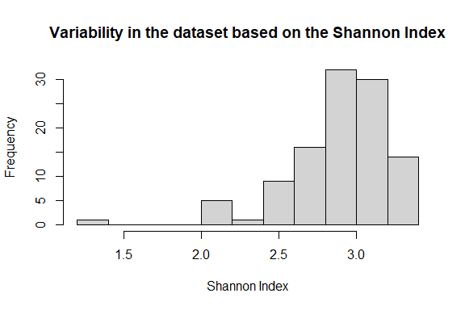
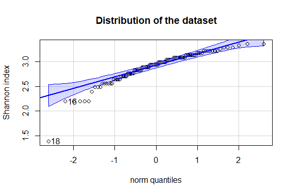
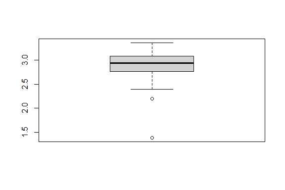
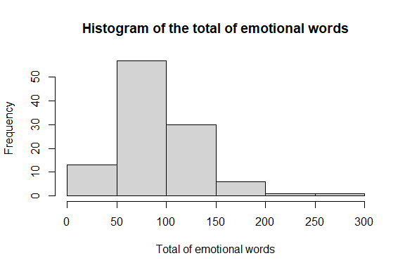
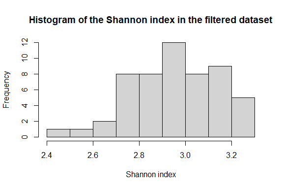
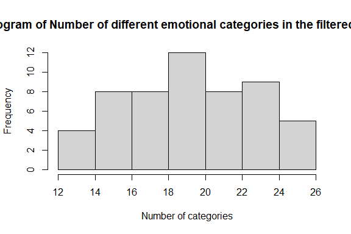
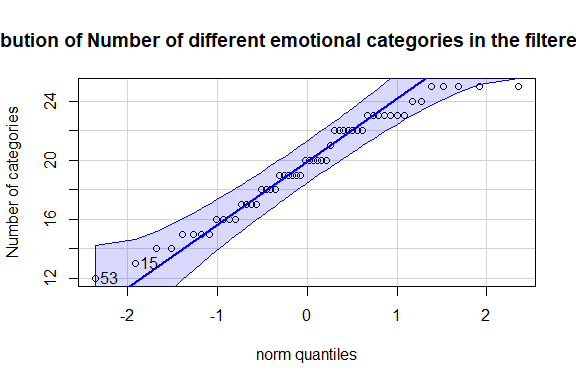
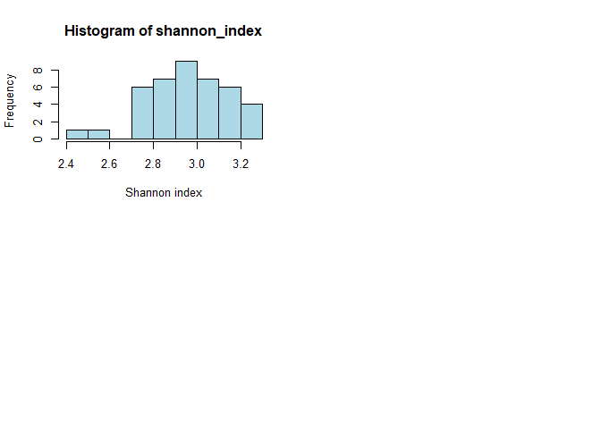

Beyond Stories: Exploring the Influence of Emotional Indicators on the
Subjective Quality Rating of Stories
================
Rachel Ferati
2025-01-09

-   <a href="#initial-dataset" id="toc-initial-dataset">Initial Dataset</a>
    -   <a href="#set-the-working-directory"
        id="toc-set-the-working-directory">Set the working directory</a>
    -   <a
        href="#path-to-the-initial-excel-file-with-data-from-the-108-transcriptions"
        id="toc-path-to-the-initial-excel-file-with-data-from-the-108-transcriptions">Path
        to the initial excel file with data from the 108 transcriptions</a>
-   <a
    href="#analysis-of-diversity-in-emotional-categories-with-the-shannon-index"
    id="toc-analysis-of-diversity-in-emotional-categories-with-the-shannon-index">Analysis
    of diversity in emotional categories with the Shannon index</a>
    -   <a href="#calculation-of-the-shannon-index"
        id="toc-calculation-of-the-shannon-index">Calculation of the Shannon
        index</a>
        -   <a href="#install-packages" id="toc-install-packages">Install
            packages</a>
        -   <a href="#verification-of-data"
            id="toc-verification-of-data">Verification of data</a>
        -   <a href="#calculation-of-the-shannon-index-1"
            id="toc-calculation-of-the-shannon-index-1">Calculation of the Shannon
            index</a>
        -   <a href="#calculation-of-the-function-in-every-data-lines"
            id="toc-calculation-of-the-function-in-every-data-lines">Calculation of
            the function in every data lines</a>
-   <a
    href="#analysis-of-variability-in-the-dataset-that-contains-the-shannon-index"
    id="toc-analysis-of-variability-in-the-dataset-that-contains-the-shannon-index">Analysis
    of Variability in the dataset that contains the Shannon index</a>
    -   <a href="#histogram-to-check-for-variability"
        id="toc-histogram-to-check-for-variability">Histogram to check for
        variability</a>
    -   <a href="#show-the-mean-median-and-sd"
        id="toc-show-the-mean-median-and-sd">Show the mean, median and SD</a>
    -   <a href="#show-the-normal-distribution"
        id="toc-show-the-normal-distribution">Show the normal distribution</a>
    -   <a href="#boxplot-to-see-the-outsiders"
        id="toc-boxplot-to-see-the-outsiders">Boxplot to see the outsiders</a>
    -   <a href="#add-column-id" id="toc-add-column-id">Add column ID</a>
    -   <a href="#distribution-of-the-total-of-emotional-words-in-the-dataset"
        id="toc-distribution-of-the-total-of-emotional-words-in-the-dataset">Distribution
        of the total of emotional words in the dataset</a>
-   <a href="#filtered-dataset-based-on-the-total-emotional-words"
    id="toc-filtered-dataset-based-on-the-total-emotional-words">Filtered
    dataset based on the total emotional words</a>
    -   <a href="#filtered-dataset-between-quantiles"
        id="toc-filtered-dataset-between-quantiles">Filtered dataset between
        Quantiles</a>
    -   <a href="#distribution-of-the-filtered-dataset"
        id="toc-distribution-of-the-filtered-dataset">Distribution of the
        Filtered dataset</a>
    -   <a href="#save-as-an-excel-file" id="toc-save-as-an-excel-file">Save as
        an excel file</a>
    -   <a href="#add-column-id-1" id="toc-add-column-id-1">Add column ID</a>
-   <a href="#filtered-dataset-based-on-total-number-of-words"
    id="toc-filtered-dataset-based-on-total-number-of-words">Filtered
    dataset based on total number of words</a>
    -   <a href="#words-counting" id="toc-words-counting">Words counting</a>
        -   <a href="#automatic-words-counting-from-the-stories-in-filtered-data"
            id="toc-automatic-words-counting-from-the-stories-in-filtered-data">Automatic
            words counting from the stories in Filtered data</a>
        -   <a href="#add-column-id-2" id="toc-add-column-id-2">Add column ID</a>
        -   <a
            href="#merge-word-count-into-filtered_data-based-on-the-identification-id"
            id="toc-merge-word-count-into-filtered_data-based-on-the-identification-id">Merge
            word count into filtered_data based on the Identification (ID)</a>
        -   <a href="#save-as-a-excel-file-the-new-filtered-data"
            id="toc-save-as-a-excel-file-the-new-filtered-data">Save as a excel file
            the new Filtered data</a>
    -   <a href="#selection-of-stories-around-the-mean-of-word-count"
        id="toc-selection-of-stories-around-the-mean-of-word-count">Selection of
        stories around the mean of word count</a>
        -   <a href="#calculation-of-the-mean-and-standard-deviation-sd"
            id="toc-calculation-of-the-mean-and-standard-deviation-sd">Calculation
            of the mean and standard deviation (SD)</a>
        -   <a href="#define-around-the-mean" id="toc-define-around-the-mean">Define
            around the mean</a>
        -   <a href="#filtered-texts-around-the-mean"
            id="toc-filtered-texts-around-the-mean">Filtered texts around the
            mean</a>
    -   <a href="#final-dataset" id="toc-final-dataset">Final dataset</a>
        -   <a href="#distribution-of-the-shannon-index-of-the-final-dataset"
            id="toc-distribution-of-the-shannon-index-of-the-final-dataset">Distribution
            of the Shannon index of the final dataset</a>
-   <a href="#establishment-of-the-common-story"
    id="toc-establishment-of-the-common-story">Establishment of the common
    story</a>
    -   <a href="#set-the-seed-for-reproducibility"
        id="toc-set-the-seed-for-reproducibility">Set the seed for
        reproducibility</a>
    -   <a href="#randomly-select-one-story-from-the-filtered_data_mean-dataset"
        id="toc-randomly-select-one-story-from-the-filtered_data_mean-dataset">Randomly
        select one story from the filtered_data_mean dataset</a>
    -   <a href="#print-the-selected-common-story"
        id="toc-print-the-selected-common-story">Print the selected common
        story</a>
-   <a href="#random-assignment-of-stories-for-group-a-and-group-b"
    id="toc-random-assignment-of-stories-for-group-a-and-group-b">Random
    assignment of stories for Group A and Group B</a>
    -   <a href="#set-the-seed-for-reproducibility-1"
        id="toc-set-the-seed-for-reproducibility-1">Set the seed for
        reproducibility</a>
    -   <a
        href="#vector-for-the-4-stories-with-high-proportion-of-different-emotional-categories"
        id="toc-vector-for-the-4-stories-with-high-proportion-of-different-emotional-categories">Vector
        for the 4 stories with high proportion of different emotional
        categories</a>
    -   <a
        href="#vector-for-the-4-stories-with-low-proportion-of-different-emotional-categories"
        id="toc-vector-for-the-4-stories-with-low-proportion-of-different-emotional-categories">Vector
        for the 4 stories with low proportion of different emotional
        categories</a>
    -   <a
        href="#randomize-stories-with-a-high-proportion-between-group-a-and-group-b"
        id="toc-randomize-stories-with-a-high-proportion-between-group-a-and-group-b">Randomize
        stories with a high proportion between Group A and Group B</a>
    -   <a
        href="#randomize-stories-with-a-low-proportion-between-group-a-and-group-b"
        id="toc-randomize-stories-with-a-low-proportion-between-group-a-and-group-b">Randomize
        stories with a low proportion between Group A and Group B</a>
    -   <a href="#assign-stories-to-group-a-and-group-b"
        id="toc-assign-stories-to-group-a-and-group-b">Assign stories to Group A
        and Group B</a>
    -   <a href="#show-the-results" id="toc-show-the-results">Show the
        results</a>

# Initial Dataset

The intital dataset comes from the experiment of Maroussia
Nicolet-dit-Félix. In total, 108 transcriptions were analyzed with the
scenario EMOTAIX using the software TROPES. The dataset contains the
name of each participant, the total number of emotional words and the
total number of different emotional categories for each transcription.

### Set the working directory

``` r
setwd("~/UNINE/4. Master en Sciences cognitives/4. Master Thesis/Stories analysis")
```

### Path to the initial excel file with data from the 108 transcriptions

``` r
library(readxl)
Stories_analysis <- read_excel("Stories analysis.xlsx")
View(Stories_analysis)
```

------------------------------------------------------------------------

# Analysis of diversity in emotional categories with the Shannon index

## Calculation of the Shannon index

### Install packages

``` r
#install.packages("readxl")
#install.packages("vegan")

library(readxl)
library(vegan)
```

### Verification of data

``` r
data <- read_excel("Stories analysis.xlsx") # Rename for simplification

names(data) # Verification of column names
```

    ## [1] "Stories"             "total_emotion_words" "categories_present"

``` r
head(data) # Verification of first lines of the dataframe
```

    ## # A tibble: 6 × 3
    ##   Stories  total_emotion_words categories_present
    ##   <chr>                  <dbl>              <dbl>
    ## 1 ALFREV02                 108                 22
    ## 2 ALLILU11                  78                 21
    ## 3 ALROCH07                 101                 16
    ## 4 ANBLTE03                 181                 27
    ## 5 ANDASA05                  72                 16
    ## 6 ANJANO07                  86                 18

### Calculation of the Shannon index

``` r
calculate_shannon_index_from_summary <- function(total_emotion_words,categories_present) {
# If no emotional words or categories, write NA
  if (total_emotion_words == 0 || categories_present == 0) {
    return(NA)
  }
  
# Calculation of the proportion in emotional categories
 proportions <- rep(1 / categories_present, categories_present)
  
# Calculation of Shannon index
shannon_index <- diversity(proportions, index = "shannon")
  
return(shannon_index)
}
```

### Calculation of the function in every data lines

``` r
data$shannon_index <- mapply(calculate_shannon_index_from_summary, 
                             data$total_emotion_words, 
                             data$categories_present)
print(data)
```

    ## # A tibble: 108 × 4
    ##    Stories  total_emotion_words categories_present shannon_index
    ##    <chr>                  <dbl>              <dbl>         <dbl>
    ##  1 ALFREV02                 108                 22          3.09
    ##  2 ALLILU11                  78                 21          3.04
    ##  3 ALROCH07                 101                 16          2.77
    ##  4 ANBLTE03                 181                 27          3.30
    ##  5 ANDASA05                  72                 16          2.77
    ##  6 ANJANO07                  86                 18          2.89
    ##  7 ANJBEL01                  96                 20          3.00
    ##  8 ANJETI02                  76                 15          2.71
    ##  9 ANMASO10                  66                 17          2.83
    ## 10 ANRAEM01                  87                 22          3.09
    ## # ℹ 98 more rows

------------------------------------------------------------------------

# Analysis of Variability in the dataset that contains the Shannon index

### Histogram to check for variability

``` r
hist(data$shannon_index, 
     main = "Variability in the dataset based on the Shannon Index", 
     xlab = "Shannon Index",
     ylab = "Frequency")
```

<!-- -->

### Show the mean, median and SD

``` r
summary(data$shannon_index)
```

    ##    Min. 1st Qu.  Median    Mean 3rd Qu.    Max. 
    ##   1.386   2.773   2.944   2.901   3.091   3.367

``` r
mean_shannonindex <- mean(data$shannon_index, na.rm = TRUE)
sd_shannonindex <- sd(data$shannon_index, na.rm = TRUE)

cat("Mean of Shannon index:", mean_shannonindex, "\n")
```

    ## Mean of Shannon index: 2.900564

``` r
cat("Standard Deviation of Shannon index:", sd_shannonindex, "\n")
```

    ## Standard Deviation of Shannon index: 0.3084879

### Show the normal distribution

``` r
library("car")
qqPlot(data$shannon_index, 
       main = "Distribution of the dataset",
       ylab = "Shannon index")
```

<!-- -->

    ## [1] 18 16

Based on those observations, it seems that N° 16 and n°18 are outsiders.

### Boxplot to see the outsiders

``` r
boxplot(data$shannon_index, mais = "Distribution and outsiders")
```

<!-- -->

### Add column ID

``` r
library(dplyr)

data <- data %>%
  mutate(ID = row_number())
```

### Distribution of the total of emotional words in the dataset

``` r
summary(data$total_emotion_words)
```

    ##    Min. 1st Qu.  Median    Mean 3rd Qu.    Max. 
    ##   12.00   63.75   87.00   91.54  109.50  267.00

``` r
hist(data$total_emotion_words,
     main = "Histogram of the total of emotional words",
     xlab = "Total of emotional words")
```

<!-- -->

# Filtered dataset based on the total emotional words

### Filtered dataset between Quantiles

``` r
library(dplyr)

Q1 <- quantile(data$total_emotion_words, 0.25)
Q3 <- quantile(data$total_emotion_words, 0.75)

# Filter the data to include only rows between Q1 and Q3
filtered_data <- data[data$total_emotion_words >= Q1 & data$total_emotion_words <= Q3, ]
print(filtered_data)
```

    ## # A tibble: 54 × 5
    ##    Stories  total_emotion_words categories_present shannon_index    ID
    ##    <chr>                  <dbl>              <dbl>         <dbl> <int>
    ##  1 ALFREV02                 108                 22          3.09     1
    ##  2 ALLILU11                  78                 21          3.04     2
    ##  3 ALROCH07                 101                 16          2.77     3
    ##  4 ANDASA05                  72                 16          2.77     5
    ##  5 ANJANO07                  86                 18          2.89     6
    ##  6 ANJBEL01                  96                 20          3.00     7
    ##  7 ANJETI02                  76                 15          2.71     8
    ##  8 ANMASO10                  66                 17          2.83     9
    ##  9 ANRAEM01                  87                 22          3.09    10
    ## 10 BAMIMA05                  69                 14          2.64    15
    ## # ℹ 44 more rows

### Distribution of the Filtered dataset

``` r
summary(filtered_data$shannon_index) # Verification of the distribution of the Shannon index
```

    ##    Min. 1st Qu.  Median    Mean 3rd Qu.    Max. 
    ##   2.485   2.833   2.996   2.960   3.124   3.219

``` r
hist(filtered_data$shannon_index,
     main = "Histogram of the Shannon index in the filtered dataset",
     xlab = "Shannon index")
```

<!-- -->

``` r
summary(filtered_data$categories_present) # Verification of the distribution
```

    ##    Min. 1st Qu.  Median    Mean 3rd Qu.    Max. 
    ##   12.00   17.00   20.00   19.63   22.75   25.00

``` r
hist(filtered_data$categories_present,
     main = "Histogram of Number of different emotional categories in the filtered dataset",
     xlab = "Number of categories") 
```

<!-- -->

``` r
library("car")
qqPlot(filtered_data$categories_present,
       main = "Distribution of Number of different emotional categories in the filtered dataset",
       ylab = "Number of categories") # Distribution
```

<!-- -->

    ## [1] 53 15

### Save as an excel file

``` r
#Install the package
#install.packages("writexl")

# Load the writexl package
library(writexl)

# Define the file path
excel_file_path <- "filtered_data.xlsx"

# Write the filtered_data data frame to an Excel file
write_xlsx(filtered_data, excel_file_path)
```

### Add column ID

``` r
library(dplyr)

filtered_data <- filtered_data %>%
  mutate(ID = row_number())
```

The filtered dataset counts 54 transcriptions.

# Filtered dataset based on total number of words

## Words counting

### Automatic words counting from the stories in Filtered data

``` r
library(readtext)

# Read every document in a file
directory_path <- "C:\\Users\\rache\\OneDrive\\Documents\\UNINE\\4. Master en Sciences cognitives\\4. Master Thesis\\Transcriptions\\Selected transcriptions"
texts <- readtext(paste0(directory_path, "/*.txt"))

# Word counting every text
count_words <- function(text) {
  words <- unlist(strsplit(text, "\\s+"))  # Separation of the text in words
  return(length(words))  # Counting the number of words
}

# Add the number of words to each text
texts$word_count <- sapply(texts$text, count_words)
```

### Add column ID

``` r
library(dplyr)

texts <- texts %>%
  mutate(ID = row_number())
```

### Merge word count into filtered_data based on the Identification (ID)

``` r
filtered_data <- merge(filtered_data, texts[, c("ID", "word_count")], by = "ID", all.x = TRUE)
```

### Save as a excel file the new Filtered data

``` r
library(writexl)

write_xlsx(filtered_data, "filtered_data_with_word_count.xlsx")
```

------------------------------------------------------------------------

## Selection of stories around the mean of word count

### Calculation of the mean and standard deviation (SD)

``` r
mean_word_count <- mean(filtered_data$word_count, na.rm = TRUE)
sd_word_count <- sd(filtered_data$word_count, na.rm = TRUE)
```

### Define around the mean

``` r
lower_bound <- mean_word_count - sd_word_count
upper_bound <- mean_word_count + sd_word_count
```

### Filtered texts around the mean

``` r
filtered_data_mean <- subset(filtered_data, word_count >= lower_bound & word_count <= upper_bound)
```

------------------------------------------------------------------------

## Final dataset

The final dataset is “filtered_data_mean”. The initial dataset with 108
transcriptions was filtered based on the total number of emotional words
and the total number of words. The final dataset counts 41
transcriptions.

### Distribution of the Shannon index of the final dataset

``` r
shannonindex_distribution <- filtered_data_mean %>%
  select("shannon_index")

par(mfrow = c(2, 2))
for (col in names(shannonindex_distribution)) {
  hist(shannonindex_distribution[[col]], breaks = 10, main = paste("Histogram of", col), xlab = "Shannon index", col = "lightblue")
}

shapiro_results_shannonindex <- lapply(shannonindex_distribution, shapiro.test)

shapiro_results_shannonindex
```

    ## $shannon_index
    ## 
    ##  Shapiro-Wilk normality test
    ## 
    ## data:  X[[i]]
    ## W = 0.94832, p-value = 0.06112

<!-- -->

# Establishment of the common story

### Set the seed for reproducibility

``` r
set.seed(123)
```

### Randomly select one story from the filtered_data_mean dataset

``` r
common_story <- filtered_data_mean[sample(nrow(filtered_data), 1), ]
```

### Print the selected common story

``` r
print(common_story)
```

    ##    ID Stories total_emotion_words categories_present shannon_index word_count
    ## 41 41  RIRO12                  78                 17      2.833213       1381

# Random assignment of stories for Group A and Group B

### Set the seed for reproducibility

``` r
set.seed(123)
```

### Vector for the 4 stories with high proportion of different emotional categories

``` r
high_proportion <- c("SAERBE09", "SADJSO02", "BEJEDI08", "MAANAU12")
```

### Vector for the 4 stories with low proportion of different emotional categories

``` r
low_proportion <- c("VEYVEM11", "CLCHJO01", "ANJETI02", "COHEIG03")
```

### Randomize stories with a high proportion between Group A and Group B

``` r
high_randomized <- sample(high_proportion)
```

### Randomize stories with a low proportion between Group A and Group B

``` r
low_randomized <- sample(low_proportion)
```

### Assign stories to Group A and Group B

``` r
Group_A <- c(high_randomized[1:2], low_randomized[1:2])
Group_B <- c(high_randomized[3:4], low_randomized[3:4])
```

### Show the results

``` r
cat("Stories for Group A :", Group_A, "\n")
```

    ## Stories for Group A : BEJEDI08 MAANAU12 ANJETI02 CLCHJO01

``` r
cat("Stories for Group B :", Group_B, "\n")
```

    ## Stories for Group B : SAERBE09 SADJSO02 COHEIG03 VEYVEM11
